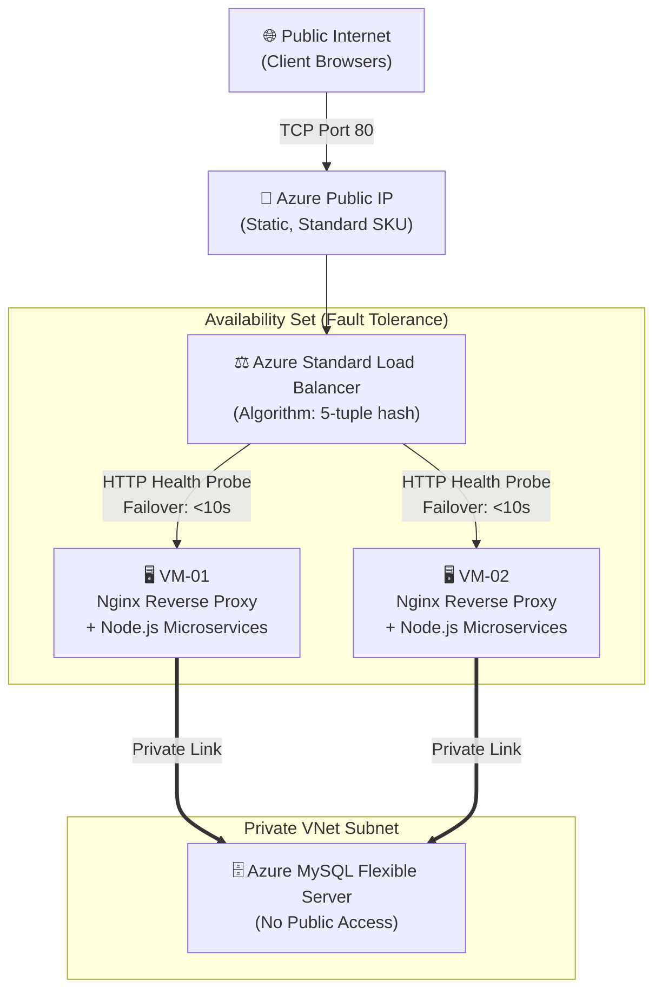

<div align="center">
  
  
  <h1>SisTrackV2 Enterprise Edition</h1>
  <p><strong>Cloud-Native Microservices Architecture for Autonomous Restaurant Management</strong></p>

  <p>
    <a href="https://github.com/adamyudhistiramuhtar-byte/SistrackV2/commits/main"></a>
    <a href="https://github.com/adamyudhistiramuhtar-byte/SistrackV2/releases"></a>
    
    
    
  </p>

  <p>
    
    
    
    
    
    
  </p>

  <p>
    <i>An industrial-grade, autonomous restaurant management system facilitating self-service ordering, backed by an active-active Cloud Load Balancing architecture, private network isolation, and precision analytic dashboards via gRPC.</i>
  </p>
</div>

---

## 📑 Executive Summary
- [Overview](#-overview)
- [Enterprise Cloud Architecture](#-enterprise-cloud-architecture)
- [Core Engineering Features](#-core-engineering-features)
- [Microservices Topology](#-microservices-topology)
- [Infrastructure & Operations Documentation](#-infrastructure--operations-documentation)
- [Local Development Guide](#-local-development-guide)
- [Testing & Quality Assurance](#-testing--quality-assurance)

---

## 🌐 Overview

**SisTrackV2 Enterprise** represents a paradigm shift from conventional monolithic systems to a distributed **Cloud-Native Microservices** architecture. The complex business logic domain has been decoupled into six (6) high-performance, independently scalable services.

Deployed on **Microsoft Azure**, the infrastructure leverages **Azure Standard Load Balancer (L4)** and **Availability Sets** to achieve strict *High Availability* (HA) and hardware fault tolerance. The system integrates HTTP/REST, `gRPC` (Protobuf), and `WebSocket` protocols to optimize inter-service communication within a secure Virtual Network (VNet).

---

## 🌩️ Enterprise Cloud Architecture

Engineered for the enterprise and deployed in the Microsoft Azure Southeast Asia region.



### Infrastructure Highlights:
1. **Azure Standard Load Balancer**: Utilizes a 5-tuple hash algorithm without session persistence to distribute millions of connections in a stateless, highly efficient manner.
2. **Availability Set Isolation**: VM instances are geographically distributed across different physical racks, power supplies, and network switches (Fault Domains) to guarantee a 99.95% SLA.
3. **Database VNet Integration**: The Azure MySQL instance is perimeter-locked. Public internet access is strictly denied; database connections are exclusively permitted from the internal compute subnet.
4. **Automated Health Probes**: The Load Balancer autonomously monitors application health. If a VM fails to respond, traffic is instantly redirected to healthy instances, ensuring *Zero-Downtime Failover*.

---

## ✨ Core Engineering Features

### 🛡️ Zero-Trust Security Posture
- **Network Isolation**: Compute instances are shielded from direct internet access. All ingress traffic is strictly routed through Network Security Groups (NSG) and the Load Balancer.
- **Cryptographic Session Management**: Customer seat sessions are tokenized using `JWT (JSON Web Token)` with HMAC SHA-256 encryption. The stateless architecture ensures tokens are validated seamlessly across the distributed cluster.
- **DDoS Mitigation**: Robust rate-limiting protections are enforced at the API Gateway layer to thwart volumetric attacks.

### ⚡ Blazing Fast Inter-Service Communication
- **Real-Time Event Engine**: Order status mutations are broadcasted via `Socket.IO`. The Nginx ingress controller is tuned to route HTTP/1.1 Upgrade Headers for frictionless WebSockets in a load-balanced environment.
- **gRPC Analytics Protocol**: Extreme-performance binary communication from the API Gateway to the Analytics Service ensures the Business Intelligence dashboard remains highly responsive, even under peak transactional loads.

### 🚦 Transactional Integrity
- **Finite State Machine**: Strict transitional patterns dictate the order lifecycle (`pending` $\rightarrow$ `confirmed` $\rightarrow$ `preparing` $\rightarrow$ `ready` $\rightarrow$ `completed`), enforced at the API level.
- **Database-as-Code**: Automated schema synchronization mechanisms (`npm run db:migrate`) guarantee database consistency across replica deployments.

---

## 🏛️ Microservices Topology

Traffic within each Virtual Machine is intelligently routed by Nginx to the PM2 Process Manager. The internal architecture is built to sustain cloud-native scalability.


| Service | Port | Technical Role |
| :--- | :---: | :--- |
| `gateway` | 3000 | Central ingress controller. Manages CORS, request routing, and traffic throttling. |
| `auth-service` | 3001 | Identity module. Issues and validates JSON Web Tokens (JWT). |
| `product-service` | 3002 | Inventory module. Manages relational master data for the restaurant menu. |
| `order-service` | 3003 | Core transactional engine and seating state management. |
| `notification-service` | 3004 | Event-driven module via Socket.io for real-time push notifications. |
| `analytics-service` | 3005 | Business Intelligence. Computes daily sales aggregates via high-speed gRPC. |

---

## 📖 Infrastructure & Operations Documentation

Corporate-grade documentation (Runbooks) is available to outline the operational guidelines and architectural design of this project within Azure Cloud.

- [**🎓 Final Project Compliance Report**](docs/Final_Compliance_Report.md) — Comprehensive Gap Analysis & Minimum Change Architecture (Chapter 4 & 5).
- [**🏗️ Azure Architecture Blueprint**](docs/cloud-infrastructure/AzureArchitecture.md) — Detailed infrastructure, VNet, and NSG designs.
- [**⚖️ Load Balancer & Compliance Analysis**](docs/04-load-balancing-and-compliance.md) — Failover mechanics and enterprise standard compliance proof.
- [**🚀 Deployment & Migration Strategy**](docs/cloud-infrastructure/DeploymentGuide.md) — VM replication SOPs and CLI automation.
- [**🔧 Infrastructure Deep-Dive**](docs/cloud-infrastructure/Infrastructure.md) — Server specification matrix and network flows.
- [**📋 Operations & Maintenance Runbook**](docs/cloud-infrastructure/OperationsRunbook.md) — Incident response procedures (P1-P4) and Disaster Recovery Plans.
- [**🔍 Troubleshooting Matrix**](docs/cloud-infrastructure/Troubleshooting.md) — Diagnostic procedures for Nginx, PM2, and Load Balancer anomalies.

---

## 🚀 Local Development Guide

Engineered for a seamless Developer Experience (DX) in local environments prior to Azure deployment.

### 1. Prerequisites
- **Node.js** (v20.x LTS)
- **MySQL Server** (Running on Port 3306)
- **PM2** (For production simulation): `npm install -g pm2`

### 2. Initialization
```bash
git clone https://github.com/adamyudhistiramuhtar-byte/SistrackV2.git
cd SistrackV2
npm install
```

### 3. Database Provisioning
Create an empty database schema named `sistrackv2` in MySQL.
```bash
# Execute DDL migrations
npm run db:migrate

# Seed initial DML data (Admin, 50 Seats, 35 Products)
npm run db:seed
```

### 4. Service Execution
Utilize the concurrent scripts to ignite the ecosystem:
```bash
# Terminal 1: Launch Backend Cluster
npm run dev:backend

# Terminal 2: Launch Vue Frontend Server
npm run dev:frontend
```
> **🌐 Web Portal**: Navigate to `http://localhost:5173`
> **🔐 Admin Dashboard**: `/admin/login` (Email: `admin@sistrack.local` | Password: `admin123`)

---

## 🧪 Testing & Quality Assurance

The system is fortified with an isolated, regression-free testing framework.
```bash
# Execute In-Memory Service Mock Testing (Jest)
npm run test:backend

# Execute Vue UI Utility Testing (Vitest)
npm run test:frontend
```

---
<div align="center">
  <br>
  <b>SisTrackV2 Enterprise</b> &copy; 2026 Adam Yudhistira Muhtar. All Rights Reserved.<br>
  <i>Engineered for Absolute Fault Tolerance.</i>
</div>
