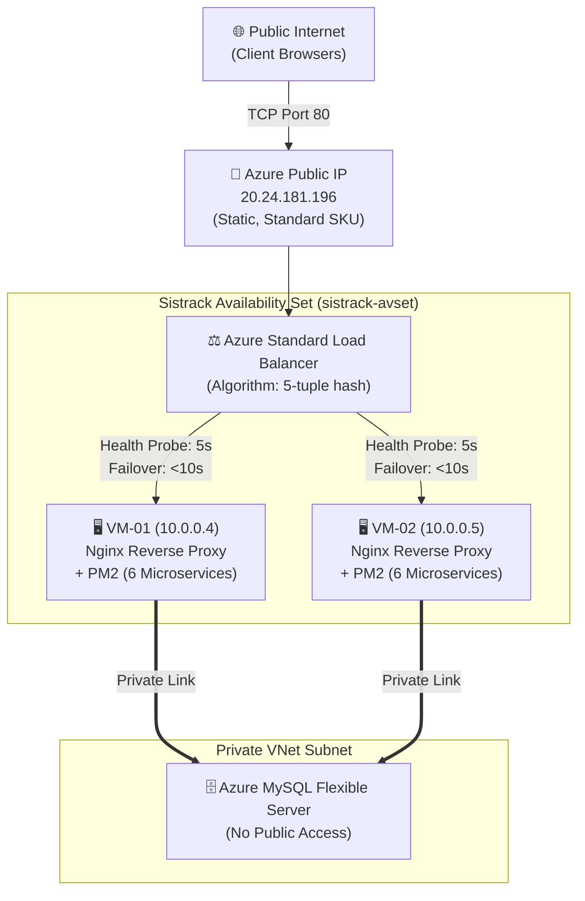
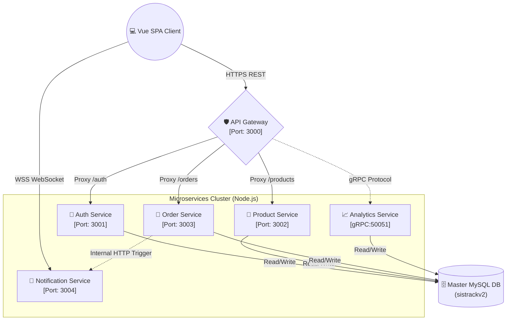

<div align="center">
  
  
  <h1>SisTrackV2 Enterprise</h1>
  <p><strong>Cloud-Native Microservices Ordering & Seating Management System with High Availability</strong></p>

  <p>
    <a href="https://github.com/adamyudhistiramuhtar-byte/SistrackV2/commits/main"></a>
    <a href="https://github.com/adamyudhistiramuhtar-byte/SistrackV2/releases"></a>
    
    
    
  </p>

  <p>
    
    
    
    
    
    
  </p>

  <p>
    <i>Sistem manajemen restoran otonom berskala industri yang memfasilitasi pemesanan mandiri (self-service), didukung arsitektur Cloud Load Balancing aktif-aktif, isolasi jaringan privat, dan Dasbor Admin analitik presisi via gRPC.</i>
  </p>
</div>

---

## 📑 Table of Contents
- [Overview](#-overview)
- [Enterprise Cloud Architecture](#-enterprise-cloud-architecture)
- [Key Features](#-key-features)
- [Microservices Cluster Topology](#-microservices-cluster-topology)
- [Deployment & Infrastructure Documentation](#-deployment--infrastructure-documentation)
- [Quick Start Guide (Local)](#-quick-start-guide-local)
- [Testing & Validation](#-testing--validation)

---

## 🌐 Overview

**SisTrackV2 Enterprise** didesain ulang dari model *monolith* konvensional menuju pola arsitektur **Cloud-Native Microservices** terdistribusi. Kami memecah domain logika bisnis yang kompleks menjadi enam (*6*) layanan berkinerja tinggi yang beroperasi secara independen. 

Sistem ini dieksekusi di atas infrastruktur **Microsoft Azure** menggunakan **Azure Standard Load Balancer (L4)** dan **Availability Sets** untuk mencapai *High Availability* dan ketahanan terhadap kegagalan perangkat keras (Fault Tolerance).

Sistem mengeksploitasi protokol HTTP/REST, `gRPC` (Protobuf), dan `WebSocket` secara bersamaan guna mengoptimalkan pola komunikasi antar-*service* di level jaringan lokal (VNet).

---

## 🌩️ Enterprise Cloud Architecture

Sistem di-deploy dengan standar industri tingkat tinggi di Microsoft Azure (Region: Southeast Asia).



### Infrastructure Highlights:
1. **Azure Standard Load Balancer**: Menggunakan algoritma 5-tuple hash tanpa *session persistence* untuk mendistribusikan jutaan koneksi secara adil dan *stateless*.
2. **Availability Set Isolation**: VM-01 dan VM-02 ditempatkan pada rak fisik, *power supply*, dan *network switch* yang berbeda (2 Fault Domains) untuk menjamin SLA 99.95%.
3. **Database VNet Integration**: Azure MySQL dikunci secara perimeter. Tidak ada akses publik yang diizinkan; koneksi database hanya diterima dari subnet web VM.
4. **Automated Health Probes**: Load Balancer secara otonom memonitor port 80 pada setiap VM setiap 5 detik. Jika sebuah VM gagal merespons, trafik dialihkan secara otomatis ke VM yang sehat (*Zero-Downtime Failover*).

---

## ✨ Key Features

### 🛡️ Enterprise Security First
- **Zero-Trust Network**: VM-02 secara arsitektur tidak memiliki IP Publik, membuatnya mustahil diretas langsung dari internet. Seluruh trafik wajib melalui *Network Security Group (NSG)* dan Load Balancer.
- **Cryptographic Session**: Tokenisasi sesi kursi pelanggan menggunakan `JWT (JSON Web Token)` dengan enkripsi HMAC SHA-256. Karena arsitekturnya *stateless*, token ini dapat divalidasi oleh VM mana pun yang menerima trafik dari Load Balancer.
- **DDoS Mitigation**: Perlindungan *Rate Limiting* di tingkat API Gateway.

### ⚡ Blazing Fast Inter-Service Communication
- **Real-Time Notification Engine**: Pembaruan status order direalisasikan menggunakan `Socket.IO`. Nginx Proxy dikonfigurasi khusus untuk merutekan *Upgrade Headers* HTTP/1.1 demi kelancaran WebSockets di lingkungan *Load-Balanced*.
- **gRPC Analytics Protocol**: Komunikasi biner performa ekstrem dari *Gateway* ke *Analytics Service*, menjamin panel BI Admin responsif meskipun volume transaksi membludak.

### 🚦 Business Logic Integrity
- **Finite State Machine**: Pola transisional ketat pada siklus pesanan (`pending` $\rightarrow$ `confirmed` $\rightarrow$ `preparing` $\rightarrow$ `ready` $\rightarrow$ `completed`) dijamin di tingkat API.
- **Database-as-Code**: Skema tersinkronisasi otomatis kapanpun VM direplikasi (`npm run db:migrate`).

---

## 🏛️ Microservices Cluster Topology

Di dalam setiap Virtual Machine, trafik didistribusikan secara internal oleh Nginx menuju Process Manager (PM2). Arsitektur internal aplikasi dibangun agar siap menopang skalabilitas *cloud-native*.



| Layanan Internal | Port | Deskripsi Peran Teknis |
| :--- | :---: | :--- |
| `gateway` | 3000 | Ingress sentral. Menangani CORS, request routing, dan proteksi limitasi trafik. |
| `auth-service` | 3001 | Modul identitas. Penerbit dan validator JSON Web Tokens (JWT). |
| `product-service` | 3002 | Modul *Inventory*. Mengelola data relasional master menu. |
| `order-service` | 3003 | *Core engine* transaksi dan manajemen state tempat duduk (seats). |
| `notification-service` | 3004 | Event-driven module via Socket.io untuk *real-time push notifications*. |
| `analytics-service` | 3005 | *Business Intelligence*. Mengkomputasi agregat penjualan harian via gRPC. |

---

## 📖 Deployment & Infrastructure Documentation

Dokumentasi level korporasi (*Runbooks*) tersedia untuk menguraikan pedoman operasional dan desain arsitektur proyek ini di Azure Cloud.

- [**🎓 Laporan Akhir Tugas Besar (Final Report)**](docs/Laporan_Tugas_Besar_SistrackV2.md) — Dokumen presentasi komprehensif.
- [**🏗️ Azure Architecture Design**](docs/cloud-infrastructure/AzureArchitecture.md) — Cetak biru infrastruktur, VNet, dan NSG.
- [**⚖️ Load Balancer & Compliance Analysis**](docs/04-load-balancing-and-compliance.md) — Mekanika failover dan pembuktian pemenuhan standar enterprise.
- [**🚀 Deployment & Migration Guide**](docs/cloud-infrastructure/DeploymentGuide.md) — SOP replikasi VM dan automasi CLI.
- [**🔧 Infrastructure Deep-Dive**](docs/cloud-infrastructure/Infrastructure.md) — Matriks spesifikasi server dan *network flows*.
- [**📋 Operations & Maintenance Runbook**](docs/cloud-infrastructure/OperationsRunbook.md) — Prosedur respon insiden (P1-P4) dan *Disaster Recovery Plan*.
- [**🔍 Troubleshooting Matrix**](docs/cloud-infrastructure/Troubleshooting.md) — Diagnosis anomali log Nginx, PM2, dan Load Balancer.

---

## 🚀 Quick Start Guide (Local)

Didesain untuk *Developer Experience (DX)* yang mulus di lingkungan lokal sebelum dilempar ke Azure.

### 1. Prerequisites
- **Node.js** (Versi `20.x LTS`).
- **MySQL Server** (Berjalan di latar belakang pada Port `3306`).
- **PM2** (Opsional untuk lingkungan Production): `npm install -g pm2`

### 2. Installation
```bash
git clone https://github.com/adamyudhistiramuhtar-byte/SistrackV2.git
cd SistrackV2
npm install
```

### 3. Database Setup
Buat *schema* database kosong bernama `sistrackv2` di MySQL.
```bash
# Menjalankan migrasi DDL otomatis
npm run db:migrate

# Mengisi DML awal (Admin, Seats, Products)
npm run db:seed
```

### 4. Running the Services
Gunakan skrip *concurrently* untuk menghidupkan ekosistem:
```bash
# Terminal 1: Nyalakan Cluster Backend
npm run dev:backend

# Terminal 2: Nyalakan Vue Frontend Server
npm run dev:frontend
```
> **🌐 Akses Web**: Buka `http://localhost:5173`
> **🔐 Akses Dasbor**: `/admin/login` (Email: `admin@sistrack.local` | Sandi: `admin123`)

---

## 🧪 Testing & Validation

Sistem dilengkapi dengan kerangka pengujian terisolasi bebas cacat regresi (*regression-free*).
```bash
# Menjalankan In-Memory Service Mock Testing (Jest)
npm run test:backend

# Menjalankan fungsi utilitas Vue UI Testing (Vitest)
npm run test:frontend
```

---
<p align="center">
  <br>
  <b>SisTrackV2 Enterprise</b> &copy; 2026. <br>
  <i>Engineered for Absolute Fault Tolerance.</i>
</p>
