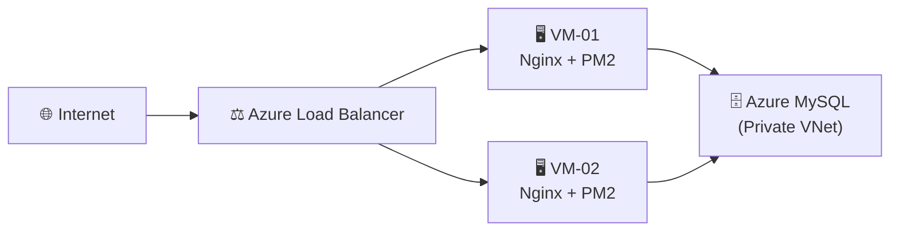

<div align="center">
  
  
  <h1>SisTrackV2</h1>
  <p><strong>Enterprise-Grade Microservices Ordering & Seating Management System</strong></p>

  <p>
    <a href="https://github.com/adamyudhistiramuhtar-byte/SistrackV2/commits/main"></a>
    <a href="https://github.com/adamyudhistiramuhtar-byte/SistrackV2/releases"></a>
    
    
  </p>

  <p>
    
    
    
    
    
    
  </p>

  <p>
    <i>Sistem manajemen restoran otonom berskala industri yang memfasilitasi pelanggan untuk memesan kursi dan hidangan secara mandiri (self-service), didukung dengan Dasbor Admin analitik yang presisi.</i>
  </p>
</div>

---

## 📑 Table of Contents
- [Overview](#-overview)
- [Key Features](#-key-features)
- [Architecture Design](#-architecture-design)
- [Project Structure](#-project-structure)
- [Quick Start Guide](#-quick-start-guide)
  - [Prerequisites](#1-prerequisites)
  - [Installation](#2-installation)
  - [Database Setup](#3-database-setup)
  - [Running the Services](#4-running-the-services)
- [Documentation & API Reference](#-documentation--api-reference)
- [Testing](#-testing)
- [Deployment (Azure Cloud)](#-deployment-azure-cloud)

---

## 🌐 Overview

**SisTrackV2** didesain ulang dari model *monolith* menuju pola arsitektur **Microservices** terdistribusi. Kami memecah domain logika bisnis yang kompleks menjadi enam (*6*) layanan berkinerja tinggi yang beroperasi secara mandiri. Keuntungan dari desain ini adalah pemisahan *concern*, ketersediaan sistem yang tinggi (*High Availability*), dan toleransi kesalahan (*Fault Tolerance*) jika terjadi *downtime* parsial.

Sistem mengeksploitasi protokol HTTP/REST, `gRPC` (Protobuf), dan `WebSocket` secara bersamaan guna menyesuaikan pola komunikasi terbaik antar-*service*.

---

## ✨ Key Features

### 🛡️ Enterprise Security First
- **Zero-Trust Input**: Validasi muatan (*payload*) agresif di tingkat *Gateway* dan *Service* menggunakan `express-validator`.
- **DDoS Mitigation**: Tiga tingkat perlindungan *Rate Limiting* (Longgar, Sedang, Ketat) untuk menghalau injeksi *Brute-Force*.
- **Cryptographic Session**: Tokenisasi sesi kursi pelanggan menggunakan `JWT (JSON Web Token)` untuk mencegah kebocoran (*hijacking*) pesanan antar meja.
- **Header Hardening**: Modul `Helmet.js` memblokir vektor serangan XSS, Clickjacking, dan MIME sniffing.

### ⚡ Blazing Fast Inter-Service Communication
- **Real-Time Notification Engine**: Pembaruan status order dari Dapur ke Layar Pelanggan direalisasikan dalam latensi *sub-millisecond* menggunakan `Socket.IO`.
- **gRPC Analytics Protocol**: Komunikasi performa ekstrem (menggunakan representasi biner) dari *Gateway* ke *Analytics Service*, menjamin panel BI Admin tetap ringan dan responsif tanpa membebani layanan transaksi order.

### 🚦 Business Logic Integrity
- **Finite State Machine**: Pola transisional ketat pada siklus pesanan (`pending` $\rightarrow$ `confirmed` $\rightarrow$ `preparing` $\rightarrow$ `ready` $\rightarrow$ `completed`) dijamin di tingkat API.
- **Automated Database DevOps**: Infrastruktur *Database-as-Code* (`npm run db:migrate`) yang mereplikasi tabel dan relasi kompleks kapanpun *server* diinisialisasi.

---

## 🏛️ Architecture Design

Arsitektur sistem dibangun agar siap menopang skalabilitas *cloud-native*. Sebuah *Gateway* bertindak sebagai *Ingress Controller* yang mendistribusikan trafik (*reverse proxy*) menuju mikro-layanan di belakang layar.

```mermaid
graph TD
    %% Eksternal
    Client(("💻 Vue SPA Client"))
    
    %% API Gateway Layer
    Gateway{"🛡️ API Gateway\n[Port: 3000]"}
    
    %% Microservices Layer
    subgraph "Microservices Cluster (Node.js)"
        Auth["🔑 Auth Service\n[Port: 3001]"]
        Product["🍔 Product Service\n[Port: 3002]"]
        Order["🛒 Order Service\n[Port: 3003]"]
        Notif["🔔 Notification Service\n[Port: 3004]"]
        Analytics["📈 Analytics Service\n[gRPC:50051]"]
    end
    
    %% Database Layer
    DB[("🗄️ Master MySQL DB\n(sistrackv2)")]

    %% Koneksi dan Jalur Komunikasi
    Client <==>|HTTPS (REST)| Gateway
    Client <==>|WSS (WebSocket)| Notif
    
    Gateway ==>|Proxy /auth| Auth
    Gateway ==>|Proxy /products| Product
    Gateway ==>|Proxy /orders| Order
    Gateway -.->|gRPC Protocol| Analytics
    
    Order -.->|Internal HTTP Trigger| Notif
    
    Auth ===> DB
    Product ===> DB
    Order ===> DB
    Analytics ===> DB
```

---

## 📁 Project Structure

SisTrackV2 menggunakan pendekatan arsitektur *Monorepo*, memusatkan *codebase* seluruh infrastruktur dalam satu ruang kontrol yang rapi:

<details>
<summary><b>Klik untuk melihat Struktur Lengkap</b></summary>
<br>

```text
SistrackV2/
├── backend/                       # ⚙️ Lapisan Microservices
│   ├── analytics-service/         # Agregasi data (Business Intelligence) via gRPC
│   ├── auth-service/              # Manajer Kredensial & Autentikasi (Bcrypt/JWT)
│   ├── gateway/                   # Ingress Controller kustom & Rate Limiting
│   ├── notification-service/      # WebSocket Event Emitter untuk sinkronisasi Real-Time
│   ├── order-service/             # Puncak komputasi logika transaksi pesanan
│   ├── product-service/           # Layanan Manajemen Katalog Produk
│   └── shared/                    # Utilitas terpusat (Logger, Security, DB Handler)
│
├── frontend/                      # 🎨 Lapisan User Interface
│   ├── src/
│   │   ├── api/                   # Network Call Interceptors (Axios) & Socket Client
│   │   ├── components/            # Pustaka Komponen (Atomic Design)
│   │   ├── layouts/               # Kerangka Halaman (Admin vs Customer Layout)
│   │   └── pages/                 # Routing Antarmuka
│   └── vite.config.js             # Konfigurasi Build Pipeline + Vitest
│
├── database/                      # 🗃️ Lapisan Automasi Infrastruktur Basis Data
│   ├── migrations/                # Schema SQL (.sql)
│   ├── seeds/                     # Skrip pembuat data awal (Seeder)
│   └── migrate.js                 # Algoritma eksekusi migrasi otomatis
│
├── docs/                          # 📖 Pustaka Pengetahuan (Knowledge Base)
└── ecosystem.config.js            # 🎛️ Manifes Daemon Process Manager (PM2)
```
</details>

---

## 🚀 Quick Start Guide

Didesain untuk *Developer Experience (DX)* yang mulus. Anda dapat menghidupkan ekosistem masif ini di lokal hanya dalam hitungan menit.

### 1. Prerequisites
Pastikan mesin Anda memiliki spesifikasi berikut:
- **Node.js** (Versi `18.x LTS` atau yang lebih baru).
- **MySQL Server** (Berjalan di latar belakang pada Port `3306`).
- **PM2** (Opsional untuk lingkungan Production): `npm install -g pm2`

### 2. Installation
Kloning repositori dan instal dependensi root. Berkat integrasi skrip, ini secara otomatis akan menginstal modul di seluruh *sub-folder* microservices dan frontend.
```bash
git clone https://github.com/adamyudhistiramuhtar-byte/SistrackV2.git
cd SistrackV2

npm install
```

### 3. Database Setup
Buat satu *schema* database kosong bernama `sistrackv2` melalui terminal MySQL Anda (`CREATE DATABASE sistrackv2;`). Setelah itu, serahkan pembentukan 7 relasi tabel kompleks pada alat migrasi internal kami:
```bash
# Mengeksekusi tabel admins, products, orders, dll.
npm run db:migrate

# Mengisinya dengan 1 Akun Admin, 12 Kursi, dan puluhan Menu dummy
npm run db:seed
```

### 4. Running the Services
Gunakan skrip `concurrently` untuk menyalakan API Gateway dan kelima *microservice* secara paralel dalam 1 jendela konsol:
```bash
# Terminal 1: Nyalakan Cluster Backend
npm run dev:backend

# Terminal 2: Nyalakan Vue Frontend Server
npm run dev:frontend
```
> **🌐 Akses Web**: Buka `http://localhost:5173` di peramban Anda.
> **🔐 Akses Dasbor**: `/admin/login` (Gunakan email: `admin@sistrack.local` | sandi: `admin123`)

---

## 📖 Documentation & API Reference

Dokumentasi level korporasi tersedia untuk menguraikan pedoman teknis mendalam proyek ini.
- [**📘 Layer 1: Panduan Proyek Utama**](docs/01-existing-project/README.md) (Dokumentasi API, Endpoint, Struktur ERD).
- [**🛠️ Layer 2: Riwayat Code Review & Improvement**](docs/02-improvement/IMPROVEMENT.md) (Rincian teknis penyelesaian 16 isu keamanan, kualitas, dan skalabilitas).
- [**☁️ Layer 3: Panduan Cloud Computing (SOP)**](docs/TUGAS_BESAR_WORKFLOW.md) (Manuskrip manual migrasi arsitektur ini menuju Microsoft Azure Cloud).

---

## 🧪 Testing

Sistem dilengkapi dengan kerangka pengujian terisolasi untuk memastikan integrasi terjamin bebas cacat regresi (*regression-free*).
```bash
# Menjalankan In-Memory Service Mock Testing (Jest)
npm run test:backend

# Menjalankan fungsi utilitas Vue UI Testing (Vitest)
npm run test:frontend
```

---

## ☁️ Deployment (Azure Cloud)

Ekosistem *Microservices* ini di-deploy pada **Microsoft Azure** menggunakan arsitektur **Multi-VM + Azure Standard Load Balancer** untuk *High Availability*:



| Komponen | Teknologi |
| :--- | :--- |
| **Load Balancer** | Azure Standard LB (L4, 5-tuple hash) |
| **Web Server** | Nginx Reverse Proxy (2 instances) |
| **Application** | PM2 Cluster (6 Microservices per VM) |
| **Database** | Azure MySQL Flexible Server (PaaS) |
| **Network** | Azure VNet + Private Subnet Isolation |

📖 **Dokumentasi Lengkap:**
- [**⚖️ Load Balancer & Compliance**](docs/04-load-balancing-and-compliance.md)
- [**🏗️ Azure Architecture**](docs/cloud-infrastructure/AzureArchitecture.md)
- [**🚀 Deployment Guide**](docs/cloud-infrastructure/DeploymentGuide.md)
- [**🔧 Infrastructure Reference**](docs/cloud-infrastructure/Infrastructure.md)
- [**🔍 Troubleshooting**](docs/cloud-infrastructure/Troubleshooting.md)
- [**📋 Operations Runbook**](docs/cloud-infrastructure/OperationsRunbook.md)

---
<p align="center">
  <br>
  <b>SisTrackV2</b> &copy; 2026. <br>
  <i>Built with absolute engineering precision.</i>
</p>
