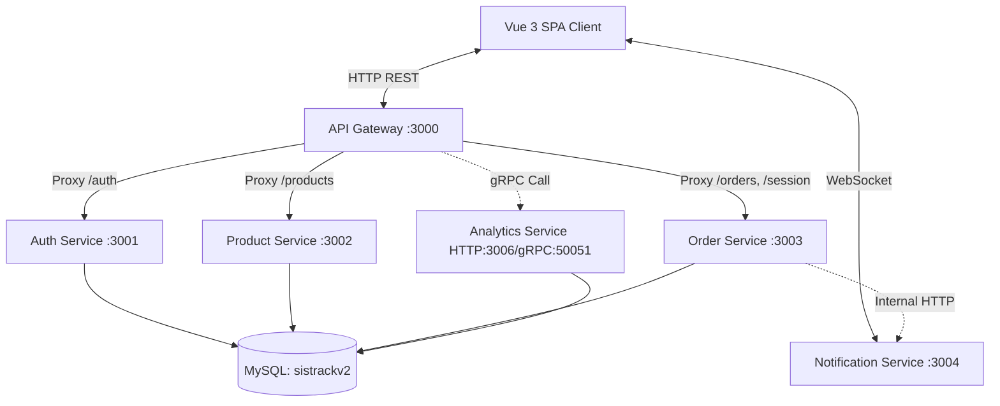
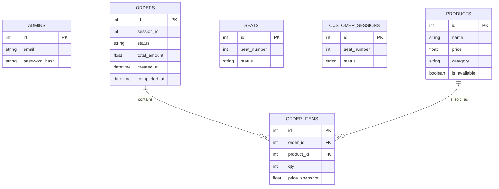

# LAYER 1 — DOKUMENTASI PROJECT YANG ADA (EXISTING PROJECT)

─────────────────────────────────────────
## 1.1 PROJECT OVERVIEW
─────────────────────────────────────────
**Nama Project**: SistrackV2
**Versi**: 1.1.0 (Improved)

**Deskripsi Fungsionalitas Utama**:
SistrackV2 adalah sebuah aplikasi manajemen reservasi kursi dan pemesanan makanan (*Ordering and Seating System*). Sistem ini mengizinkan pelanggan untuk memesan meja secara mandiri dan menelusuri menu secara digital. Seluruh proses dari pemilihan kursi hingga keranjang belanja *(checkout)* dilakukan dalam antarmuka web yang terintegrasi.

Aplikasi telah diperbarui dengan standar *enterprise* melalui arsitektur berbasis *microservices*. Terdapat sistem manajemen *state* order pesanan yang dilengkapi notifikasi *real-time* via WebSocket (Socket.IO), sistem analitik dengan performa tinggi via gRPC, serta berbagai peningkatan keamanan seperti pembatasan *rate limiting*, keamanan HTTP header dengan Helmet, dan penggunaan Session JWT untuk otorisasi keranjang.

**Target Pengguna**:
1. **Customer**: Pelanggan restoran yang ingin memesan tempat dan makanan secara *self-service*.
2. **Admin/Staf**: Karyawan restoran yang bertugas mengelola katalog dan melayani order.

**Tabel Tech Stack**:
| Kategori        | Teknologi                  | Versi        |
|-----------------|----------------------------|--------------|
| Frontend        | Vue 3 + Vite + TailwindCSS | v3.5 / v3.4  |
| Backend         | Node.js (Express.js)       | v18+ / v5.2  |
| Database        | MySQL (mysql2 promise)     | v3.16        |
| Auth & Security | JWT, bcrypt, Helmet, RateLimit | v9.0 / v6.0 |
| RPC / Event     | gRPC & Socket.IO           | v1.14 / v4.8 |
| API Gateway     | http-proxy-middleware      | v3.0         |
| DevOps & Run    | PM2 & Concurrently         | v5.3 / v8.2  |
| Testing         | Jest (Backend), Vitest (FE)| v29.7 / v1.6 |

**Diagram Arsitektur Aplikasi**:


─────────────────────────────────────────
## 1.2 STRUKTUR DIREKTORI
─────────────────────────────────────────
```text
SistrackV2/
├── backend/                  # Source code utama untuk server backend
│   ├── analytics-service/    # Service gRPC/HTTP untuk mengumpulkan metrik analitik
│   ├── auth-service/         # Service untuk autentikasi dan pembuatan token JWT
│   ├── gateway/              # API Gateway (Reverse proxy ke service lain)
│   ├── notification-service/ # Service berbasis Socket.IO untuk notifikasi pesanan real-time
│   ├── order-service/        # Service manajemen pembuatan pesanan, state, & session
│   ├── product-service/      # Service manajemen katalog, stok produk, dan kategori
│   ├── shared/               # Modul umum (logger, validateEnv, rateLimiter, errorHandler)
│   └── package.json          # Terpusat untuk script development (`npm run dev:all`)
│
├── database/                 # Skrip migrasi & seeding database
│   ├── migrations/           # Definisi skema tabel SQL
│   ├── seeds/                # Dummy data produk dan admin
│   └── migrate.js            # Custom migration runner
│
├── frontend/                 # Source code utama untuk antarmuka pengguna
│   ├── src/                  
│   │   ├── api/              # useOrderSocket.js, pemanggilan API axios
│   │   ├── tests/            # Vitest unit test
│   │   └── ...
│   └── vite.config.js        # Konfigurasi Vite & Vitest
│
├── ecosystem.config.js       # Konfigurasi PM2 untuk menjalankan 6 service production
├── package.json              # Root package.json (shortcuts)
└── run.all.ps1               # Skrip eksekusi lokal seluruh microservices (opsional)
```

─────────────────────────────────────────
## 1.3 INSTALASI & SETUP LOKAL
─────────────────────────────────────────
**# Prerequisites**
- Node.js v18+
- MySQL Server (Port 3306)
- PM2 (`npm install -g pm2`)

**# Clone & Install**
```bash
git clone [repo-url]
cd SistrackV2

# Install dependensi Frontend
cd frontend && npm install

# Install dependensi Backend 
cd ../backend
npm install
# Pastikan juga npm install di dalam setiap folder service (auth-service, gateway, dll)
```

**# Konfigurasi Environment**
Buat file `.env` di dalam `backend/gateway/.env` yang digunakan bersama oleh migrasi dan gateway.
```env
PORT=3000
DB_HOST=localhost
DB_USER=root
DB_PASSWORD=
DB_NAME=sistrackv2
JWT_SECRET=supersecret-min-32-chars-for-security
AUTH_SERVICE_URL=http://localhost:3001
PRODUCT_SERVICE_URL=http://localhost:3002
ORDER_SERVICE_URL=http://localhost:3003
NOTIFICATION_SERVICE_URL=http://localhost:3004
ANALYTICS_GRPC_URL=localhost:50051
```

**# Database Setup (Automated)**
Sistem ini menggunakan Custom Database Migration & Seeding terpusat.
Jalankan dari direktori ROOT project:
```bash
# 1. Jalankan semua migrasi tabel ke DB sistrackv2
npm run db:migrate

# 2. Masukkan data dummy (Admin, Produk Makanan, Kursi)
npm run db:seed
```

**# Menjalankan Aplikasi**
Terdapat dua mode untuk menjalankan aplikasi di lingkungan lokal:

**Mode Development (Hot-Reload)**:
```bash
npm run dev:backend   # Menjalankan 6 service sekaligus via Concurrently
npm run dev:frontend  # Menjalankan Vue Vite
```

**Mode Production/Staging (PM2)**:
```bash
npm run start         # Memutar seluruh microservice dalam background
npm run stop          # Menghentikan seluruh microservice
```

─────────────────────────────────────────
## 1.4 DOKUMENTASI DATABASE
─────────────────────────────────────────


─────────────────────────────────────────
## 1.5 API DOCUMENTATION
─────────────────────────────────────────

### [POST] /api/session/seat
**Deskripsi**: Reservasi kursi pelanggan dan pembuatan Token JWT Session (Pengganti pengiriman `seatNumber` via form).
**Request Body**:
```json
{ "seat_number": 5 }
```
**Response Success (200)**:
```json
{
  "success": true,
  "token": "eyJhbGciOiJIUzI1...",
  "seat_number": 5
}
```

### [GET] /api/products/available
**Deskripsi**: Menampilkan daftar makanan, dengan dukungan filter kategori, paginasi, dan search.
**Query Params**: `?category=Makanan&search=Nasi&page=1&limit=10`

### [POST] /api/orders
**Deskripsi**: Membuat pesanan baru. Nomor meja diambil dari header session JWT, bukan body request.
**Request Headers**:
- `X-Session-Token`: `[Token dari /api/session/seat]`
**Request Body**:
```json
{
  "customerName": "Budi",
  "items": [{ "product_id": 1, "qty": 2, "price": 25000 }]
}
```

### [PATCH] /api/orders/:id/status
**Deskripsi**: Mengubah status pesanan menggunakan pola State Machine (contoh: `pending` -> `confirmed`). Otomatis men-trigger Notifikasi *Real-Time* via Socket.IO ke sisi pelanggan dan analitik.
**Request Body**: `{ "status": "confirmed" }`

─────────────────────────────────────────
## 1.6 FITUR APLIKASI
─────────────────────────────────────────

#### Fitur: Pemesanan Makanan (Customer Flow)
1. Pelanggan memilih kursi (hit API `/api/session/seat`).
2. Menerima Session Token dan otomatis diarahkan ke menu (`/api/products/available`).
3. Checkout via `/api/orders` menyertakan Token, meniadakan resiko pemalsuan pesanan kursi orang lain.
4. Tampilan Web otomatis memperbarui status (Waiting -> Preparing -> Ready) tanpa perlu refresh berkat Socket.IO.

#### Fitur: Manajemen Produk & Pesanan (Admin Flow)
1. Admin login ke dashboard yang terlindungi secara Rate Limiting yang ketat.
2. Memperoleh data secara riil-waktu atas pesanan masuk.
3. Merubah ketersediaan produk, dan merubah status order menggunakan State Machine.
4. Dapat melihat chart *Analytics Summary* agregat penjualan secara performant menggunakan sinkronisasi GRPC & HTTP API `/api/analytics/dashboard`.

─────────────────────────────────────────
## 1.7 TESTING
─────────────────────────────────────────
Proyek ini sekarang dilengkapi dengan kerangka pengujian (Automated Testing) untuk sisi Backend dan Frontend.

**Menjalankan Backend Tests (Jest)**:
```bash
npm run test:backend
```
Pengujian unit telah dipasang untuk servis krusial seperti `auth.service.js` menggunakan In-Memory Mocking.

**Menjalankan Frontend Tests (Vitest)**:
```bash
npm run test:frontend
```
Pengujian fungsi dan utility Vue telah diterapkan. Semua pengujian menggunakan isolasi modul standar industri untuk memverifikasi fungsionalitas seperti *formatCurrency*.
