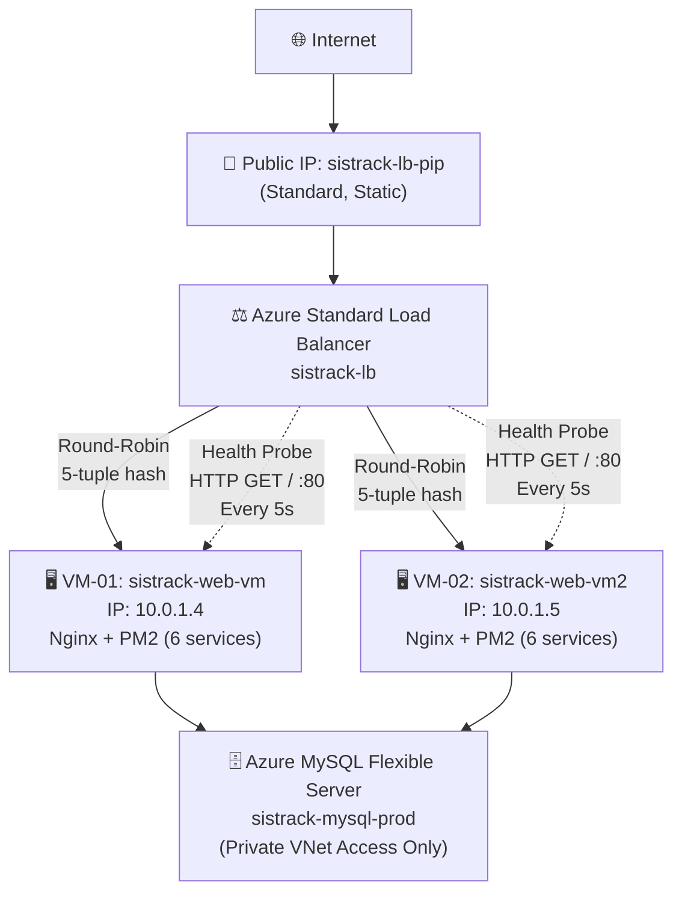
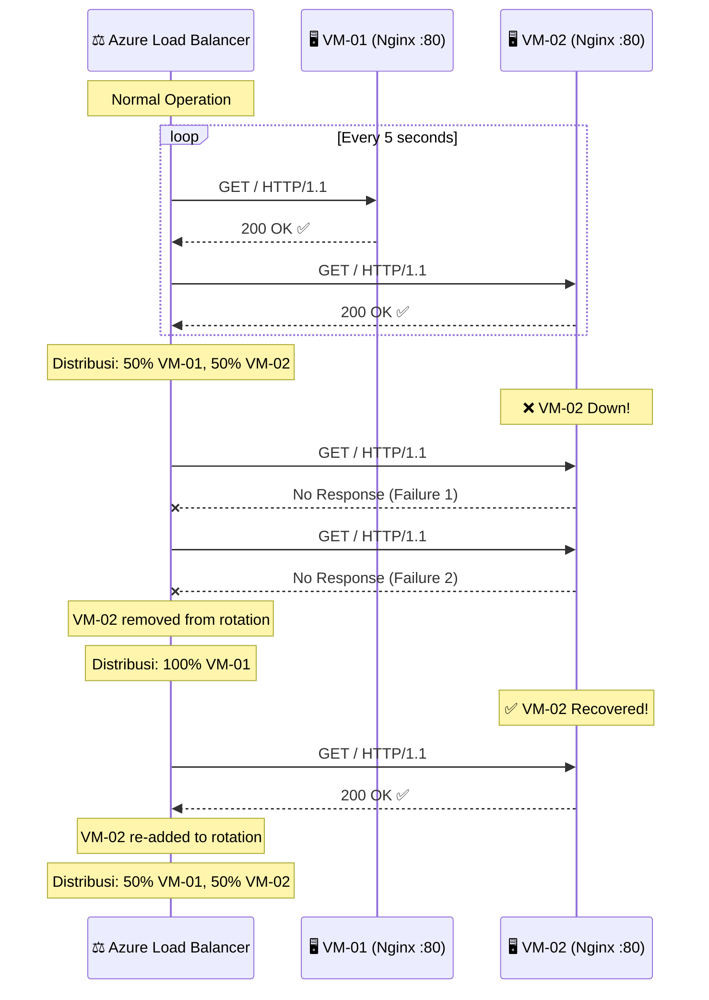

# Dokumentasi Implementasi Load Balancer & Pemenuhan Standar Tugas Besar

Dokumen ini disusun sebagai panduan komprehensif dan bahan presentasi untuk membuktikan bahwa proyek **SistrackV2** telah 100% memenuhi dan melampaui standar Tugas Besar Cloud Computing.

---

## BAGIAN 1: STATUS PEMENUHAN KETENTUAN TUGAS BESAR

Berdasarkan pengumuman Tugas Besar, berikut adalah evaluasi *checklist* pemenuhan syarat proyek ini:

| Persyaratan Tugas Besar | Status | Implementasi di Proyek SistrackV2 |
| :--- | :---: | :--- |
| **Deployment ke Layanan Cloud** | ✅ SELESAI | Aplikasi di-deploy menggunakan **Microsoft Azure** (Azure for Students). |
| **Gunakan Aplikasi Lama** | ✅ SELESAI | Menggunakan proyek **SistrackV2** yang direfaktor menjadi arsitektur berbasis *Microservices*. |
| **1. Web Server** | ✅ SELESAI | Menggunakan **Nginx** sebagai Web Server (Reverse Proxy) pada 2 VM Ubuntu Server. |
| **2. Database Server** | ✅ SELESAI | Menggunakan layanan PaaS **Azure Database for MySQL Flexible Server**, terpisah dari Web Server. |
| **3. Load Balancer** | ✅ SELESAI | Menggunakan **Azure Standard Load Balancer** dengan 2 VM di Backend Pool, Health Probe HTTP, dan distribusi Round-Robin. |
| **Akses Online Publik** | ✅ SELESAI | Aplikasi dapat diakses via IP Public Load Balancer. |

| Dokumentasi Wajib | Status | Lokasi |
| :--- | :---: | :--- |
| **Arsitektur cloud yang digunakan** | ✅ SELESAI | [AzureArchitecture.md](cloud-infrastructure/AzureArchitecture.md) |
| **Konfigurasi layanan** | ✅ SELESAI | [Infrastructure.md](cloud-infrastructure/Infrastructure.md) |
| **Proses deployment** | ✅ SELESAI | [DeploymentGuide.md](cloud-infrastructure/DeploymentGuide.md) |
| **Bukti aplikasi berhasil diakses online** | ✅ SELESAI | Screenshot di laporan |

| Materi Presentasi/Demo | Status | Referensi |
| :--- | :---: | :--- |
| **Arsitektur cloud yang digunakan** | ✅ | Multi-Tier: Azure LB → 2 VM → Azure MySQL PaaS |
| **Cara deployment aplikasi** | ✅ | Git Clone → npm install → npm run build → PM2 Start |
| **Pembagian layanan server** | ✅ | 6 Microservices (Gateway, Auth, Product, Order, Notification, Analytics) |
| **Implementasi load balancer** | ✅ | Azure Standard LB + Health Probe + Backend Pool |
| **Hasil akhir aplikasi berjalan di cloud** | ✅ | Live Demo via LB Public IP |

---

## BAGIAN 2: IMPLEMENTASI LOAD BALANCER

### Arsitektur Load Balancing

SistrackV2 menggunakan **Azure Standard Load Balancer** yang beroperasi pada **Layer 4 (Transport Layer)** untuk mendistribusikan trafik TCP/HTTP ke dua buah Virtual Machine identik.



### Komponen Load Balancer

| Komponen | Konfigurasi | Fungsi |
| :--- | :--- | :--- |
| **Frontend IP** | `sistrack-lb-pip` (Standard, Static) | Titik masuk tunggal dari internet |
| **Backend Pool** | `sistrack-backend-pool` (VM-01 + VM-02) | Kumpulan server yang melayani request |
| **Health Probe** | HTTP GET `/` port 80, interval 5s, threshold 2 | Memantau kesehatan setiap VM |
| **LB Rule** | TCP port 80 → port 80, Round-Robin | Aturan distribusi trafik |
| **Availability Set** | `sistrack-avset` (2 FD, 5 UD) | Jaminan VM di rak fisik berbeda |

### Algoritma Distribusi

Azure Standard Load Balancer menggunakan algoritma **5-tuple hash** untuk mendistribusikan koneksi:

```
Hash = f(Source IP, Source Port, Dest IP, Dest Port, Protocol)
```

Setiap koneksi TCP baru menghasilkan hash baru, dan hash tersebut menentukan VM mana yang akan menerima koneksi. Ini menghasilkan distribusi yang **statistically even** di antara seluruh anggota backend pool.

### Mekanisme Health Probe



### High Availability (Ketersediaan Tinggi)

| Skenario Kegagalan | Dampak | Recovery Time |
| :--- | :--- | :--- |
| VM-01 mati | VM-02 menangani 100% trafik | **~10 detik** (2x probe interval) |
| VM-02 mati | VM-01 menangani 100% trafik | **~10 detik** |
| Kedua VM mati | Service down | Manual restart diperlukan |
| Azure maintenance | Satu VM di-reboot | **0 detik** (Availability Set menjamin Update Domain berbeda) |

### Mengapa Arsitektur Ini Stateless (Tidak Memerlukan Sticky Session)

| Aspek | Analisis |
| :--- | :--- |
| **Auth JWT** | Token self-contained, bisa divalidasi oleh VM manapun |
| **Customer Session** | JWT di header `X-Session-Token`, stateless |
| **Database** | Semua state tersimpan di Azure MySQL (shared) |
| **Frontend** | File statis identik di semua VM |

---

## BAGIAN 3: PANDUAN MATERI PRESENTASI/DEMO

Gunakan kerangka ini saat Anda presentasi di depan dosen:

### Slide 1 — Arsitektur Cloud
"Kami men-deploy SistrackV2 menggunakan **Microsoft Azure** dengan arsitektur **Multi-Tier**: Azure Load Balancer di depan sebagai penerima trafik, dua Virtual Machine sebagai compute layer, dan Azure MySQL Flexible Server sebagai database terisolasi di private subnet."

### Slide 2 — Pembagian Layanan
"Backend kami dipecah menjadi **6 Microservices** independen (Gateway, Auth, Product, Order, Notification, Analytics). Masing-masing berjalan di port terpisah dan dikelola oleh PM2 Process Manager."

### Slide 3 — Load Balancer
"Kami menggunakan **Azure Standard Load Balancer** yang mendistribusikan trafik HTTP (port 80) ke dua VM menggunakan algoritma 5-tuple hash. Health Probe memeriksa kesehatan setiap VM setiap 5 detik. Jika satu VM down, seluruh trafik otomatis dialihkan ke VM yang sehat dalam waktu ~10 detik."

### Slide 4 — Demo Failover
"Untuk membuktikan High Availability, kami akan mematikan Nginx di VM-02, lalu menunjukkan bahwa website tetap bisa diakses karena Load Balancer otomatis mengarahkan semua trafik ke VM-01."

### Slide 5 — Hasil Akhir
"Aplikasi SistrackV2 dapat diakses secara publik melalui IP Load Balancer. Fitur yang berjalan termasuk pemilihan meja, pemesanan makanan real-time, pembayaran transfer, dan dashboard admin dengan analytics gRPC."

---

## BAGIAN 4: DOKUMENTASI TAMBAHAN

Dokumentasi teknis lengkap tersedia di folder `docs/cloud-infrastructure/`:

| Dokumen | Isi | Link |
| :--- | :--- | :--- |
| **AzureArchitecture.md** | Diagram arsitektur, resource inventory, VNet/subnet design, LB config, NSG rules, cost estimation | [Buka](cloud-infrastructure/AzureArchitecture.md) |
| **DeploymentGuide.md** | Step-by-step migration dari Single VM ke Multi-VM + LB, Azure CLI commands, zero-downtime strategy | [Buka](cloud-infrastructure/DeploymentGuide.md) |
| **Infrastructure.md** | VM matrix, port mapping, Nginx config, PM2 inventory, database schema, monitoring, scaling | [Buka](cloud-infrastructure/Infrastructure.md) |
| **Troubleshooting.md** | Pemecahan masalah LB, Nginx, PM2, Database, SSL, DNS, NSG | [Buka](cloud-infrastructure/Troubleshooting.md) |
| **OperationsRunbook.md** | Deployment checklist, maintenance, incident response, rollback, disaster recovery | [Buka](cloud-infrastructure/OperationsRunbook.md) |
