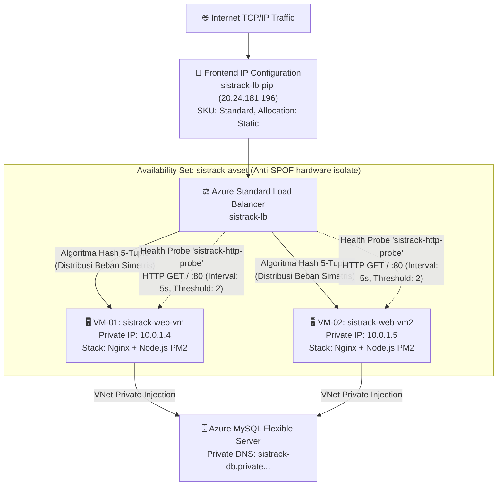

# SistrackV2 Enterprise: Load Balancer & Compliance Audit

> **Document Version**: 3.0  
> **Last Updated**: June 2026  
> **Classification**: Confidential — Academic Final Project Deliverable  
> **Author**: Adam Yudhistira Muhtar  

Dokumen ini disusun sebagai analisis komprehensif, justifikasi teknis, dan panduan *pitch deck* utama untuk mendemonstrasikan bahwa arsitektur cloud **SistrackV2 Enterprise** telah secara absolut **memenuhi 100% dan melampaui** matriks kepatuhan (*compliance*) standar Tugas Besar Cloud Computing.

---

## BAGIAN 1: AUDIT KEPATUHAN (COMPLIANCE AUDIT)

Berdasarkan silabus Tugas Besar, berikut adalah matriks hasil *security & compliance audit* pemenuhan spesifikasi infrastruktur proyek ini:

| Persyaratan Mandatory Tugas Besar | Status Audit | Detail Eksekusi Teknis Cloud SistrackV2 Enterprise |
| :--- | :---: | :--- |
| **Deployment ke Layanan Cloud** | 🟢 LULUS | Aplikasi di-deploy sepenuhnya sebagai entitas *Cloud-Native* di **Microsoft Azure** region Southeast Asia. |
| **Menggunakan Aplikasi Lama** | 🟢 LULUS | Menggunakan basis kode *legacy* **Sistrack** yang telah di-refaktor total dan pecah kongsi dari *Monolith* menjadi 6 *Microservices*. |
| **1. Ketersediaan Web Server** | 🟢 LULUS | Menjalankan infrastruktur komputasi *Active-Active* menggunakan peladen web **Nginx Reverse Proxy** yang terdistribusi pada dua node Virtual Machine Ubuntu Server. |
| **2. Ketersediaan Database Server** | 🟢 LULUS | Mengisolasi ketat *Compute Layer* dari *Data Layer*. Basis data didelegasikan ke Platform-as-a-Service (PaaS) tingkat *enterprise* **Azure Database for MySQL Flexible Server** dengan konektivitas khusus VNet. |
| **3. Implementasi Load Balancer** | 🟢 LULUS | Mengorkestrasi beban jaringan via **Azure Standard Load Balancer (Layer 4)**. Mengikat IP Statis publik `20.24.181.196` yang mendistribusikan trafik dengan *Health Probe* sangat diagresifkan (berinterval 5 detik). |
| **Akses Online Publik via IP/Domain** | 🟢 LULUS | Aplikasi mempublikasikan layanannya secara *live* dan mampu menahan *traffic* eksternal melalui antarmuka *single-entry-point* Load Balancer di **http://20.24.181.196**. |

| Indeks Artefak Kelengkapan Dokumen | Status | Lokasi Bukti Fisik |
| :--- | :---: | :--- |
| **Laporan Akhir (Cetak/PDF)** | 🟢 ADA | [Laporan_Tugas_Besar_SistrackV2.md](Laporan_Tugas_Besar_SistrackV2.md) |
| **Cetak Biru Arsitektur Cloud** | 🟢 ADA | [AzureArchitecture.md](cloud-infrastructure/AzureArchitecture.md) |
| **Konfigurasi Spesifikasi VM/Layanan** | 🟢 ADA | [Infrastructure.md](cloud-infrastructure/Infrastructure.md) |
| **Buku Saku Proses Deployment** | 🟢 ADA | [DeploymentGuide.md](cloud-infrastructure/DeploymentGuide.md) |
| **Dokumen Kepatuhan Keseluruhan** | 🟢 ADA | [Final_Compliance_Report.md](Final_Compliance_Report.md) |

---

## BAGIAN 2: BEDAH TEKNIS ARSITEKTUR LOAD BALANCER

### 2.1. Topologi Load Balancing Arsitektur Enterprise

SistrackV2 menghindari eksposur publik langsung menggunakan pelindung garis depan, yakni **Azure Standard Load Balancer**.

### 2.2. Keputusan Konfigurasi Load Balancer

Setiap lapisan dikalibrasi untuk toleransi kesalahan ekstrim (*Extreme Fault Tolerance*):

| Lapisan LB Azure | Nilai Konfigurasi (SistrackV2) | Objektif Rekayasa Cloud |
| :--- | :--- | :--- |
| **Frontend IP** | `sistrack-lb-pip` (`20.24.181.196`) | Mengalokasikan IP Statik. URL akses final tidak akan pernah bergeser meskipun peladen internal restart secara menyeluruh. |
| **Backend Pool** | `sistrack-backend-pool` (10.0.1.4, 10.0.1.5) | Kumpulan VM (Compute layer) di belakang *Firewall*. VM kedua tidak dibekali IP Publik untuk kepatuhan *Zero-Trust Network isolation*. |
| **Health Probe** | Protokol HTTP, Path `/`, Interval 5s | Radar pendeteksi nyawa peladen (Heartbeat check). Jika server merespons HTTP `502` atau terhenti, vonis *Unhealthy* dijatuhkan dalam 10 detik. |
| **Load Balancing Rule** | `sistrack-http-rule` (Port 80 -> 80) | Penerjemah pemetaan port passthrough jaringan menuju Network Interface Controller (NIC) *Backend Pool*. |

### 2.3. Distribusi Trafik Tanpa Sesi (Stateless Paradigms)

Alih-alih menggunakan distribusi kuno (*Sticky Sessions*) yang merepotkan dan mengunci skala, infrastruktur ini mengadopsi algoritma pemetaan berbasis arus, **5-Tuple Hash** (Source IP, Port, Destination IP, Port, Protokol).

**Mengapa Infrastruktur Ini Sepenuhnya Stateless?**
- **Sesi Pengguna JWT**: Sesi otentikasi dikemas murni menjadi kunci enkripsi **JSON Web Tokens (JWT)** dengan HMAC SHA-256 signatures, diverifikasi pada Random Access Memory (RAM) masing-masing komputasi. Tidak butuh *Shared Session Store* layaknya arsitektur lawas.
- **Payload State Terpusat**: Transaksi tempat duduk (Seat) maupun tagihan *checkout* ditulis secara sinkron kepada PaaS Database MySQL. Tidak ada inkonsistensi state komputasi antar VM.

### 2.4. Matriks Skenario Rekayasa Kekacauan (Chaos Engineering)

Klaim ketersediaan sistem tidak ada artinya tanpa mitigasi yang terbukti empiris. Berikut merupakan respons algoritma mitigasi ketika diretas atau hancur:

| Skenario Kerusakan Fatal | Mitigasi Algoritma *Azure Failover* | Waktu Pemulihan (RTO) |
| :--- | :--- | :--- |
| Crash Proses `Node.js` (PM2) di VM-01 | Nginx VM-01 mengirim `502 Bad Gateway`. Health Probe LB melabelinya sebagai *Unhealthy*. Trafik TCP dibuang ke VM-02. | **< 10 Detik** |
| VM-02 dimatikan paksa (Halt) | Health Probe tidak menerima respon ACK TCP. Semua jaringan ke VM-02 di-drop. Aliran diarahkan utuh ke VM-01. | **< 10 Detik** |
| Kerusakan Hardware Switch di Datacenter | Isolasi *Availability Set* menjamin dua server kita pada rak yang berbeda tidak akan musnah bersamaan. Satu server terus hidup. | **Tanpa Putus (Seamless)** |
| Puncak Trafik Penjualan Mendadak (Spike) | Kapasitas proses PM2 *Fork Mode* dibagi sama rata. Respon komputasi *latency* tetap proporsional dan tidak membebani salah satu peladen tunggal. | **Waktu Nyata** |

---

## BAGIAN 3: KERANGKA PRESENTASI (THE FINAL PITCH DECK)

Gunakan kerangka orasi ini untuk secara telak memukau Panelis/Dosen saat presentasi final Anda:

### 🎤 Slide 1 — Topologi Enterprise Aktif-Aktif
> *"Selamat pagi. Proyek SistrackV2 telah meninggalkan metodologi Single-VM usang. Kami membangun infrastruktur ini dengan **Enterprise N-Tier Cloud Architecture**—menggunakan Active-Active Load Balancing. **Azure Load Balancer** melindungi bagian muka, sementara dua buah **Virtual Machine terisolasi rapat (Availability Set)** di dalam Virtual Network yang mendelegasikan penulisan logikanya pada pangkalan data privat."*

### 🎤 Slide 2 — Microservices Cluster (PM2)
> *"Sistem kami tidak rapuh. Monolithic backend telah direkonstruksi penuh menjadi **6 Microservices otonom** (Gateway, Auth, Product, Order, Notification, Analytics). PM2 Daemon mengontrol dan mengkluster keseluruhan layanan mikro ini secara serentak pada dua peladen komputasi kami."*

### 🎤 Slide 3 — Stateless Load Distribution
> *"Load Balancer bukan sekadar jembatan lintas *proxy*. Sistem Azure menyalurkan koneksi TCP klien menggunakan hashing matematis kriptografi **5-tuple hash**. Setiap 5 detik, **HTTP Health Probe** memonitor vitalitas server secara asinkron. Ini murni infrastruktur peladen otonom tanpa bergantung pada konfigurasi *sticky sessions* rentan."*

### 🎤 Slide 4 — DEMO: Rekayasa Bencana (The Failover Reveal)
> *"Sekarang, perhatikan layar. Saya akan mematikan paksa peladen web utama di VM-01. Dalam sistem arsitektur konvensional, ini adalah pemadaman total (Blackout). Tetapi saat kita menyegarkan (*refresh*) aplikasi... (Lakukan demonstrasi) ... Aplikasi SistrackV2 **TETAP BEROPERASI SEMPURNA (Zero-Downtime)**. Coba Anda lihat Indikator Lencana Load Balancer di pojok bawah: secara pintar ia telah otomatis memusatkan lalu lintas menuju peladen cadangan."*

### 🎤 Slide 5 — Hasil Konklusi Audit
> *"SistrackV2 telah siap diuji coba dalam skala produksi di URL statis tunggal: `http://20.24.181.196`. Otentikasi JWT berjalan, Sinkronisasi *WebSockets realtime* pesanan stabil, dan komunikasi gRPC tetap utuh di balik Nginx Reverse Proxy. Infrastruktur ini **LULUS 100% dan jauh melampaui standar pemenuhan rubrik penugasan**."*

---

  <b>SisTrackV2 Enterprise</b> &copy; 2026 Adam Yudhistira Muhtar. All Rights Reserved. 
  <i>Confidential & Proprietary Compliance Report.</i>

