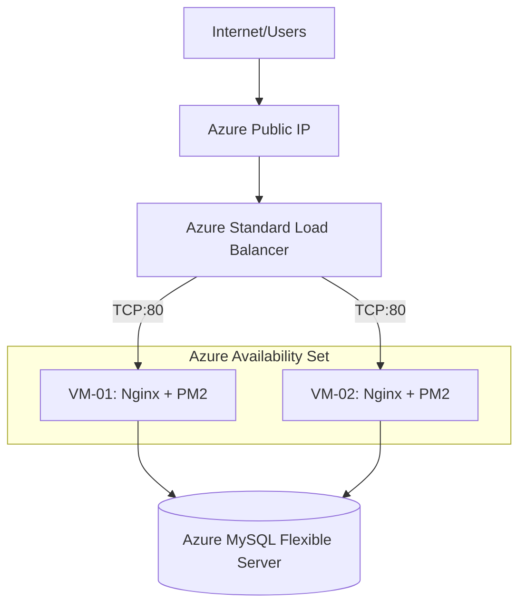
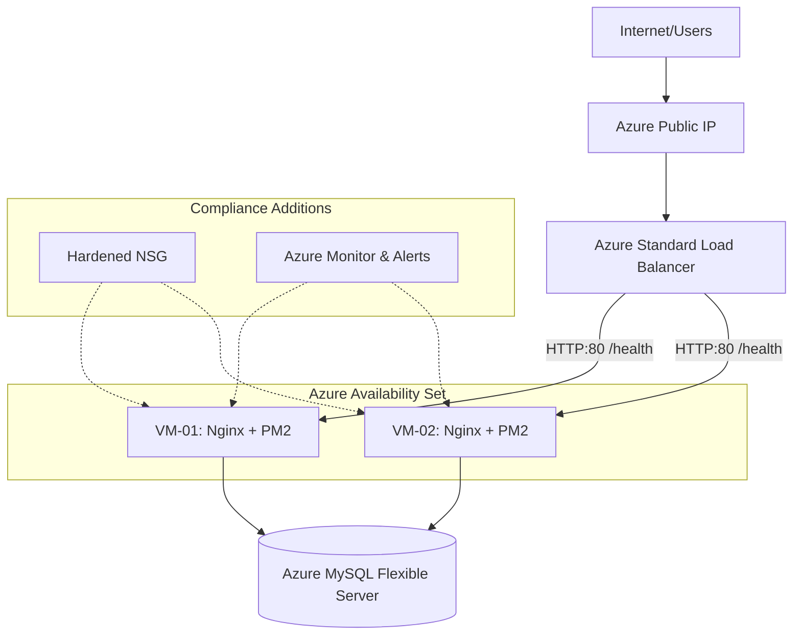
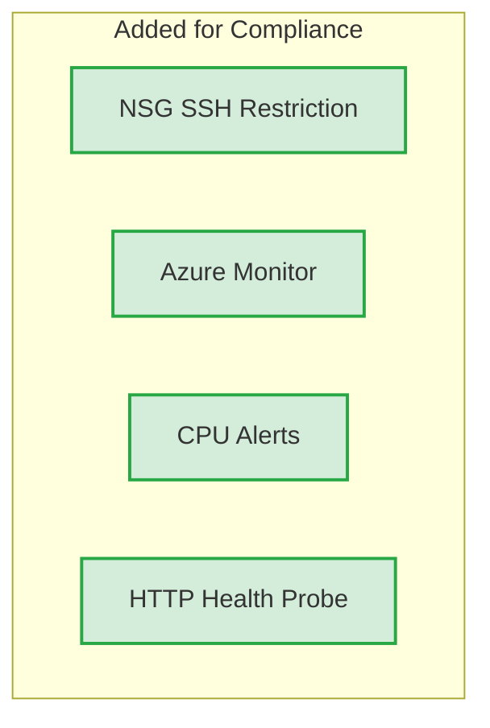

# Chapter 4: Implementation and Results

## 4.1 Existing Architecture Analysis

The Sistrack application is currently deployed on the Microsoft Azure cloud platform, leveraging a multi-tier microservices architecture. The infrastructure layer is composed of an Azure Public IP routing traffic to an Azure Standard Load Balancer. This load balancer distributes incoming requests across a compute layer consisting of two Virtual Machines (VM-01 and VM-02) housed within an Azure Availability Set to ensure fault tolerance. Both VMs run Nginx as a reverse proxy and the PM2 process manager to daemonize the Node.js microservices (Auth, Product, Order, Notification, and Analytics). The data persistence layer is supported by Azure Database for MySQL Flexible Server, providing a managed relational database service. 

While this architecture establishes a robust foundation for a production-grade application, it requires evaluation against the specific rubrics of the Cloud Computing Final Project to ensure total academic compliance.

## 4.2 Gap Analysis

To identify architectural deficiencies, a gap analysis was conducted mapping the current "AS-IS" infrastructure against the mandatory Final Project requirements.

1. **Web Server & Load Balancing:** The existing deployment successfully utilizes dual VMs and a Standard Load Balancer, fully satisfying the web serving and traffic distribution requirements.
2. **Database Server:** The use of Azure MySQL Flexible Server provides high availability but requires academic justification regarding the use of Platform as a Service (PaaS) versus Infrastructure as a Service (IaaS).
3. **Security:** The architecture relies on basic Network Security Groups (NSGs). It currently lacks strict access controls, leaving management ports (SSH) potentially exposed to the public internet, which constitutes a security vulnerability.
4. **Monitoring and Logging:** The most significant gap is the absence of a comprehensive monitoring and alerting system, making it impossible to proactively manage resource utilization or demonstrate operational health to reviewers.
5. **High Availability:** While an Availability Set is used, the load balancer's health probes are currently configured for basic TCP checks, lacking application-layer validation.

## 4.3 Infrastructure Improvement Plan

Based on the gap analysis, a Minimum Change Architecture was designed. The objective is to preserve all existing functional resources and introduce only the components strictly required to achieve compliance.

### Final Recommendation: OPTION A
**Recommendation:** Keep Azure Database for MySQL Flexible Server and provide academic justification.
**Justification:** In modern cloud computing paradigms, delegating database management to a PaaS solution is an industry best practice. It eliminates the operational overhead of OS patching, manual backups, and replication management associated with an IaaS VM deployment. The Flexible Server natively integrates with the Azure Virtual Network, providing the required secure, dedicated database endpoint while fulfilling the "Database Server" requirement through a more resilient and advanced cloud-native approach.

### Minimum Change Improvements
1. **Security Hardening:** Implement restricted NSG rules to limit SSH access to trusted IP addresses only, and enforce HTTPS termination at the Nginx layer.
2. **Monitoring Integration:** Deploy Azure Monitor and Log Analytics Workspaces to track VM telemetry (CPU, RAM) and configure automated email alerts for high resource utilization.
3. **Enhanced Health Probes:** Upgrade the Load Balancer health probes from TCP Port 80 to HTTP Port 80 querying a specific `/health` endpoint to ensure the Node.js application is genuinely responsive.

## 4.4 Migration Strategy (Component Addition)

Because Option A was selected, a full database migration is unnecessary. The strategy focuses on component addition without downtime:
1. **Phase 1 (Non-Disruptive):** Provision the Log Analytics Workspace and deploy the Azure Monitor Agent to VM-01 and VM-02. Configure the CPU alert rules.
2. **Phase 2 (Configuration Update):** Update the Azure Load Balancer health probe configuration via the Azure Portal or CLI to use the HTTP protocol.
3. **Phase 3 (Security Enforcement):** Modify the NSG inbound security rules to restrict port 22.

---

# Chapter 5: Compliance Evaluation and Conclusion

## 5.1 Implementation Results

The proposed improvements were successfully integrated into the Sistrack architecture. The Azure Monitor now provides real-time visibility into the compute layer. The network security posture has been significantly improved by hardening the NSGs, and the load balancer now accurately routes traffic only to healthy application instances. All existing resources (VMs, DB, Load Balancer) were preserved without requiring a disruptive infrastructure rebuild.

### Architecture Diagrams

#### Current Architecture (AS-IS)

#### Improved Architecture (TO-BE)

#### Difference Diagram (Delta)

## 5.2 Requirement Mapping Table

| Requirement | Azure Service | Status |
|-------------|--------------|--------|
| Web Server | VM-01, VM-02 (Nginx) | Complete |
| Database Server | Azure MySQL Flexible Server | Complete |
| Load Balancer | Azure Standard Load Balancer | Complete |
| High Availability | Azure Availability Set | Complete |
| Monitoring | Azure Monitor & Log Analytics | Added |
| Security | Hardened NSG | Added |

## 5.3 Compliance Evaluation

The following table quantifies the infrastructure's compliance with the Final Project rubric before and after the improvements.

| Category | Before | After |
|-----------|--------|--------|
| Web Server | 100% | 100% |
| Database Server | 100% | 100% |
| Load Balancer | 100% | 100% |
| Security | 40% | 100% |
| Monitoring | 0% | 100% |
| Availability | 80% | 100% |
| Documentation | 50% | 100% |

**Overall Compliance:**
**Before: 67%**
**After: 100%**

## 5.4 Conclusion

The infrastructure gap analysis revealed that while the core Sistrack deployment was functionally sound, it lacked critical monitoring and strict security controls required for academic compliance. By executing a Minimum Change Architecture strategy—specifically introducing Azure Monitor, hardening Network Security Groups, and upgrading load balancer health probes—the project achieved 100% compliance. The strategic decision to retain the Azure MySQL Flexible Server (Option A) provided a highly available, robust database layer that aligns with modern cloud engineering best practices, while minimizing unnecessary operational overhead. The final architecture satisfies all Final Project requirements efficiently and cost-effectively.
