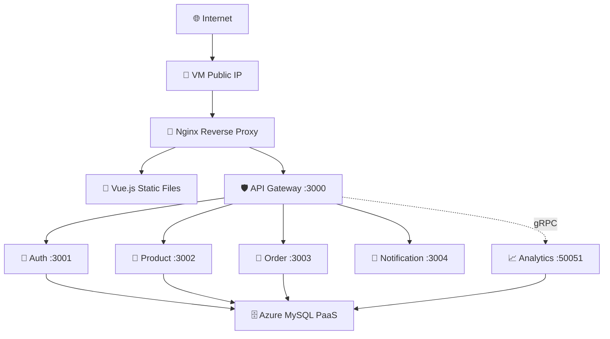
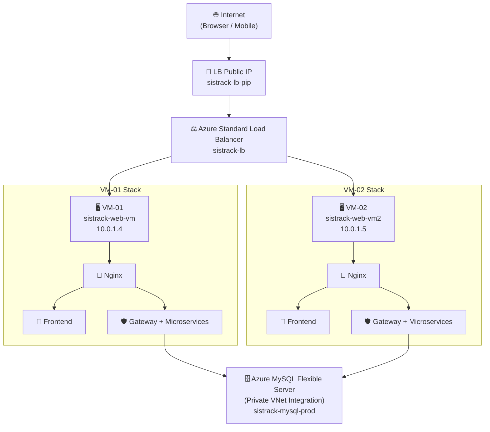
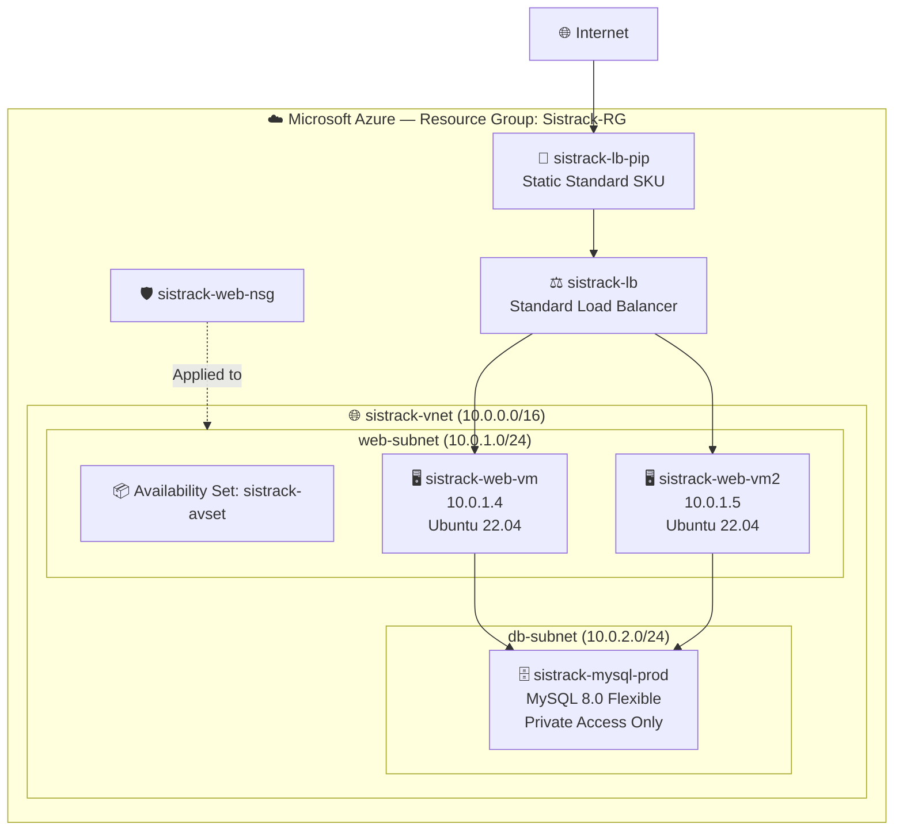
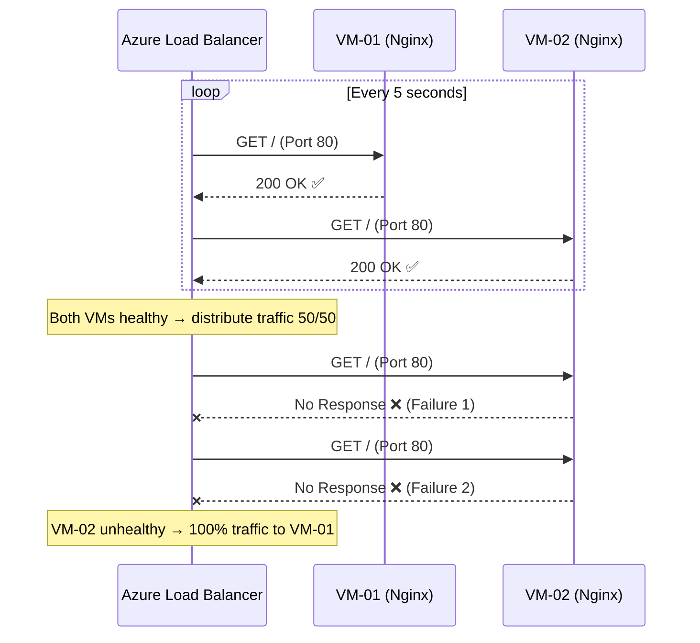

# Azure Cloud Architecture — SistrackV2

> **Document Version**: 2.0  
> **Last Updated**: June 2026  
> **Architecture Pattern**: Multi-VM + Azure Standard Load Balancer + Shared PaaS Database  
> **Cloud Provider**: Microsoft Azure (Azure for Students)

---

## Table of Contents

- [1. Architecture Overview](#1-architecture-overview)
- [2. Architecture Evolution](#2-architecture-evolution)
- [3. Final Target Architecture](#3-final-target-architecture)
- [4. Azure Resource Inventory](#4-azure-resource-inventory)
- [5. Resource Group Structure](#5-resource-group-structure)
- [6. Virtual Network Design](#6-virtual-network-design)
- [7. Subnet Design](#7-subnet-design)
- [8. Public IP Design](#8-public-ip-design)
- [9. Azure Load Balancer Configuration](#9-azure-load-balancer-configuration)
- [10. Backend Pool Configuration](#10-backend-pool-configuration)
- [11. Health Probe Configuration](#11-health-probe-configuration)
- [12. Load Balancing Rules](#12-load-balancing-rules)
- [13. Network Security Group Configuration](#13-network-security-group-configuration)
- [14. Availability Set Configuration](#14-availability-set-configuration)
- [15. Session Persistence Analysis](#15-session-persistence-analysis)
- [16. Cost Estimation](#16-cost-estimation)
- [17. Security Best Practices](#17-security-best-practices)

---

## 1. Architecture Overview

SistrackV2 menggunakan arsitektur **Multi-Tier Cloud** pada Microsoft Azure, yang dirancang untuk memenuhi tiga pilar utama: **High Availability**, **Scalability**, dan **Security Isolation**.

Arsitektur ini terdiri dari tiga lapisan utama:

| Layer | Komponen | Fungsi |
| :--- | :--- | :--- |
| **Internet Layer** | Azure Standard Load Balancer + Public IP | Penerima dan penyeimbang trafik global |
| **Compute Layer** | 2x Ubuntu VM (Nginx + PM2 + Node.js) | Menjalankan Frontend statis dan 6 Backend Microservices |
| **Data Layer** | Azure MySQL Flexible Server (PaaS) | Database terpusat dengan Private VNet Integration |

---

## 2. Architecture Evolution

### Phase 1 — Single VM (Arsitektur Awal)



### Phase 2 — Multi-VM + Azure Load Balancer (Arsitektur Akhir / Sekarang)



---

## 3. Final Target Architecture



---

## 4. Azure Resource Inventory

| # | Resource Name | Resource Type | SKU / Tier | Region | Resource Group |
| :---: | :--- | :--- | :--- | :--- | :--- |
| 1 | `Sistrack-RG` | Resource Group | — | Southeast Asia | — |
| 2 | `sistrack-vnet` | Virtual Network | — | Southeast Asia | Sistrack-RG |
| 3 | `web-subnet` | Subnet | /24 (251 hosts) | — | Sistrack-RG |
| 4 | `db-subnet` | Subnet (Delegated) | /24 (251 hosts) | — | Sistrack-RG |
| 5 | `sistrack-web-vm` | Virtual Machine | Standard_B1s | Southeast Asia | Sistrack-RG |
| 6 | `sistrack-web-vm2` | Virtual Machine | Standard_B1s | Southeast Asia | Sistrack-RG |
| 7 | `sistrack-mysql-prod` | MySQL Flexible Server | Burstable B1ms | Southeast Asia | Sistrack-RG |
| 8 | `sistrack-lb` | Load Balancer | Standard | Southeast Asia | Sistrack-RG |
| 9 | `sistrack-lb-pip` | Public IP Address | Standard, Static | Southeast Asia | Sistrack-RG |
| 10 | `sistrack-avset` | Availability Set | 2 FD / 5 UD | Southeast Asia | Sistrack-RG |
| 11 | `sistrack-web-nsg` | Network Security Group | — | Southeast Asia | Sistrack-RG |
| 12 | `sistrack-ssh-key` | SSH Key | RSA 4096 | Southeast Asia | Sistrack-RG |

---

## 5. Resource Group Structure

```text
Sistrack-RG/
├── Networking
│   ├── sistrack-vnet
│   │   ├── web-subnet (10.0.1.0/24)
│   │   └── db-subnet (10.0.2.0/24, Delegated to MySQL)
│   ├── sistrack-web-nsg
│   └── sistrack-lb-pip (Static Standard Public IP)
│
├── Compute
│   ├── sistrack-avset (Availability Set)
│   ├── sistrack-web-vm  (VM-01, in avset)
│   │   ├── OS Disk
│   │   └── NIC (attached to web-subnet)
│   └── sistrack-web-vm2 (VM-02, in avset)
│       ├── OS Disk
│       └── NIC (attached to web-subnet)
│
├── Load Balancing
│   └── sistrack-lb (Standard Load Balancer)
│       ├── Frontend IP: sistrack-lb-pip
│       ├── Backend Pool: sistrack-backend-pool
│       ├── Health Probe: sistrack-http-probe
│       └── LB Rule: sistrack-http-rule
│
└── Database
    └── sistrack-mysql-prod (Azure MySQL Flexible Server)
```

---

## 6. Virtual Network Design

| Parameter | Value |
| :--- | :--- |
| **VNet Name** | `sistrack-vnet` |
| **Address Space** | `10.0.0.0/16` (65,536 addresses) |
| **Region** | Southeast Asia |
| **DNS Servers** | Azure-provided (Default) |

Desain ini menggunakan **satu VNet tunggal** dengan **dua subnet terisolasi** untuk memisahkan *Compute Tier* dari *Data Tier*. Pendekatan ini menerapkan prinsip **Defense-in-Depth**: Database tidak pernah terekspos ke internet publik.

---

## 7. Subnet Design

| Subnet Name | CIDR | Purpose | Delegated | NSG |
| :--- | :--- | :--- | :--- | :--- |
| `web-subnet` | `10.0.1.0/24` | VM-01, VM-02 (Compute) | No | `sistrack-web-nsg` |
| `db-subnet` | `10.0.2.0/24` | Azure MySQL (Data) | Yes (MySQL Flexible) | Managed by Azure |

**Isolation Principle**: VM di `web-subnet` bisa berkomunikasi ke `db-subnet` melalui VNet peering internal. Namun, `db-subnet` sama sekali tidak memiliki jalur keluar ke internet (*no Public IP, no NAT*), sehingga mustahil untuk diserang dari luar.

---

## 8. Public IP Design

### Before Migration (Single VM)
| Resource | IP Type | SKU | Assignment |
| :--- | :--- | :--- | :--- |
| `sistrack-web-vm-pip` | Public | Basic/Dynamic | Attached to VM-01 NIC |

### After Migration (Load Balanced)
| Resource | IP Type | SKU | Assignment |
| :--- | :--- | :--- | :--- |
| `sistrack-lb-pip` | Public | **Standard, Static** | Frontend IP of Load Balancer |
| VM-01 NIC | Private only | — | `10.0.1.4` (no public IP) |
| VM-02 NIC | Private only | — | `10.0.1.5` (no public IP) |

> **Penting**: Setelah migrasi ke Load Balancer, IP Public VM-01 yang lama akan dipindahkan ke Load Balancer. Kedua VM hanya memiliki IP Private dan diakses melalui LB atau SSH Jump Box / Azure Bastion.

---

## 9. Azure Load Balancer Configuration

| Parameter | Value |
| :--- | :--- |
| **Name** | `sistrack-lb` |
| **SKU** | Standard |
| **Type** | Public |
| **Frontend IP** | `sistrack-lb-pip` (Static) |
| **Region** | Southeast Asia |

### Why Standard SKU (bukan Basic)?
- **Requirement**: Azure Standard LB **wajib** digunakan bersama VMs di Availability Set.
- **Features**: Mendukung Health Probes berbasis HTTP path, multiple backend pools, dan zona ketersediaan (*Availability Zones*).
- **SLA**: Microsoft menjamin 99.99% availability.

---

## 10. Backend Pool Configuration

| Parameter | Value |
| :--- | :--- |
| **Pool Name** | `sistrack-backend-pool` |
| **Associated To** | Availability Set (`sistrack-avset`) |

| VM | Private IP | Status |
| :--- | :--- | :--- |
| `sistrack-web-vm` | `10.0.1.4` | Active Member |
| `sistrack-web-vm2` | `10.0.1.5` | Active Member |

Kedua VM di-*register* ke dalam satu Backend Pool. Load Balancer akan mendistribusikan trafik masuk secara merata ke kedua VM ini.

---

## 11. Health Probe Configuration

| Parameter | Value |
| :--- | :--- |
| **Probe Name** | `sistrack-http-probe` |
| **Protocol** | HTTP |
| **Port** | 80 |
| **Path** | `/` |
| **Interval** | 5 seconds |
| **Unhealthy Threshold** | 2 consecutive failures |

### How It Works
Setiap 5 detik, Azure Load Balancer mengirim HTTP GET ke `http://<VM-IP>:80/` pada setiap VM. Jika Nginx di VM tersebut merespons dengan HTTP 200, VM dianggap **healthy** dan tetap menerima trafik. Jika gagal 2 kali berturut-turut, VM otomatis **dikeluarkan** dari rotasi sampai pulih kembali.



---

## 12. Load Balancing Rules

| Parameter | Value |
| :--- | :--- |
| **Rule Name** | `sistrack-http-rule` |
| **Frontend IP** | `sistrack-lb-pip` |
| **Protocol** | TCP |
| **Frontend Port** | 80 |
| **Backend Port** | 80 |
| **Backend Pool** | `sistrack-backend-pool` |
| **Health Probe** | `sistrack-http-probe` |
| **Session Persistence** | None (Round-Robin) |
| **Idle Timeout** | 4 minutes |
| **Floating IP** | Disabled |

### Traffic Distribution Algorithm
Azure Standard Load Balancer menggunakan algoritma **5-tuple hash** secara default:
1. Source IP
2. Source Port
3. Destination IP
4. Destination Port
5. Protocol

Ini berarti setiap koneksi TCP baru didistribusikan secara merata di antara VM-01 dan VM-02, memaksimalkan utilisasi sumber daya.

---

## 13. Network Security Group Configuration

### `sistrack-web-nsg` (Applied to web-subnet)

#### Inbound Rules

| Priority | Name | Port | Protocol | Source | Destination | Action |
| :---: | :--- | :--- | :--- | :--- | :--- | :--- |
| 100 | `Allow-HTTP` | 80 | TCP | Any | Any | **Allow** |
| 110 | `Allow-HTTPS` | 443 | TCP | Any | Any | **Allow** |
| 120 | `Allow-SSH` | 22 | TCP | Your IP / Azure Bastion | Any | **Allow** |
| 130 | `Allow-LB-Probe` | Any | Any | AzureLoadBalancer | Any | **Allow** |
| 65000 | `DenyAllInbound` | Any | Any | Any | Any | **Deny** |

#### Outbound Rules

| Priority | Name | Port | Protocol | Source | Destination | Action |
| :---: | :--- | :--- | :--- | :--- | :--- | :--- |
| 100 | `Allow-MySQL` | 3306 | TCP | web-subnet | db-subnet | **Allow** |
| 110 | `Allow-Internet` | Any | TCP | Any | Internet | **Allow** |

> **Catatan Keamanan**: Rule `Allow-LB-Probe` (Priority 130) **wajib ada**. Tanpa rule ini, Health Probe dari Azure Load Balancer akan ditolak oleh NSG, dan semua VM akan dianggap *unhealthy*.

---

## 14. Availability Set Configuration

| Parameter | Value |
| :--- | :--- |
| **Name** | `sistrack-avset` |
| **Fault Domains** | 2 |
| **Update Domains** | 5 |
| **Managed Disks** | Yes (Aligned) |

### Mengapa Availability Set?

- **Fault Domains (FD)**: Azure menjamin VM-01 dan VM-02 ditempatkan pada **rak server fisik yang berbeda**. Jika satu rak mengalami kegagalan hardware, VM di rak lain tetap beroperasi.
- **Update Domains (UD)**: Saat Azure melakukan pemeliharaan (*host maintenance*), hanya satu Update Domain yang di-reboot pada satu waktu. Minimal satu VM selalu aktif.
- **SLA**: Dengan Availability Set + Standard LB, Microsoft menjamin **99.95% uptime SLA**.

---

## 15. Session Persistence Analysis

### Apakah SistrackV2 Membutuhkan Sticky Sessions?

| Aspek | Analisis | Kesimpulan |
| :--- | :--- | :--- |
| **Autentikasi Admin** | JWT Token di-attach di header `Authorization`. Token self-contained (stateless). | ❌ Tidak perlu sticky |
| **Sesi Pelanggan** | JWT Token di header `X-Session-Token`. Stateless. | ❌ Tidak perlu sticky |
| **State Management** | Semua state disimpan di MySQL (shared database). Tidak ada in-memory session. | ❌ Tidak perlu sticky |
| **Frontend Assets** | File statis identik di semua VM. | ❌ Tidak perlu sticky |
| **Socket.IO** | WebSocket connections bersifat persistent per-VM, namun notification adalah broadcast event. | ⚠️ Minor (acceptable) |

**Kesimpulan**: Arsitektur SistrackV2 sepenuhnya **stateless** di sisi server. Session Persistence **tidak diperlukan**. Menggunakan distribusi **Round-Robin** adalah pilihan optimal.

---

## 16. Cost Estimation

| Resource | SKU | Monthly Cost (Est.) |
| :--- | :--- | :--- |
| VM-01 (`Standard_B1s`) | Free Tier Eligible | **$0** (750 hrs/mo free) |
| VM-02 (`Standard_B1s`) | Pay-as-you-go | **~$7.59** |
| Azure MySQL Flexible (`Burstable B1ms`) | Development | **~$6.21** |
| Standard Load Balancer | Per-rule + data | **~$18.25** (1 rule) |
| Public IP (Standard, Static) | Per-hour | **~$3.65** |
| Managed Disks (2x 30GB P4) | Premium SSD | **~$9.60** |
| **TOTAL** | | **~$45.30/month** |

> **Azure for Students**: Anda memiliki **$100 kredit gratis**. Arsitektur ini dapat berjalan selama **~2 bulan** penuh tanpa biaya apapun.

---

## 17. Security Best Practices

| Practice | Implementation |
| :--- | :--- |
| **Private Database** | Azure MySQL hanya bisa diakses via VNet (Private Access). Zero public endpoint. |
| **SSH Key Authentication** | Password login dinonaktifkan. Hanya RSA key pair yang diizinkan. |
| **NSG Least Privilege** | Hanya Port 80, 443, 22 yang terbuka. Default deny-all. |
| **Helmet.js** | HTTP Security Headers (XSS, MIME, Clickjacking protection) di Gateway. |
| **Rate Limiting** | 3-tier rate limiter di API Gateway (auth: ketat, write: sedang, read: longgar). |
| **JWT Stateless Auth** | Token berbasis kriptografi, tidak perlu shared session store. |
| **VNet Isolation** | Compute dan Data tier berada di subnet terpisah dalam satu VNet. |
| **No Root Login** | SSH menggunakan user `azureuser` / `ubuntu`, bukan root. |
