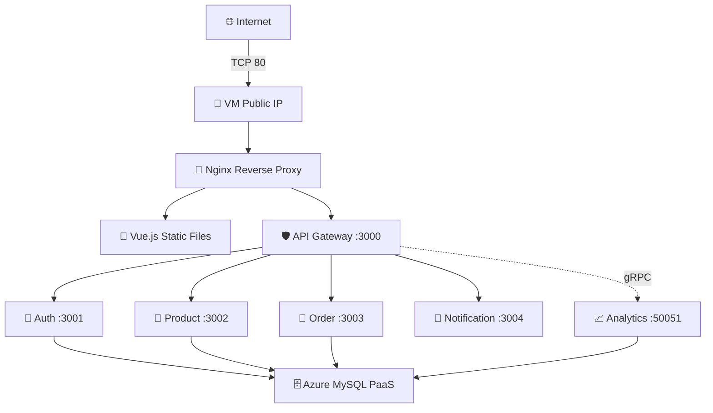
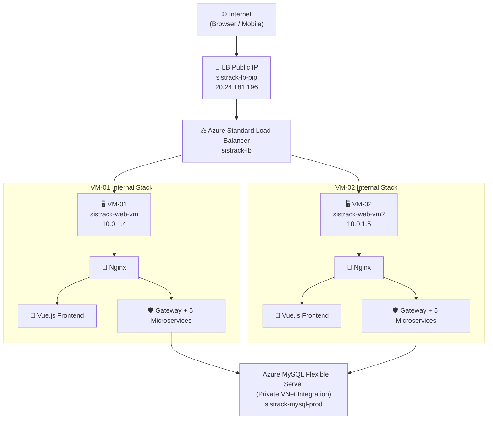
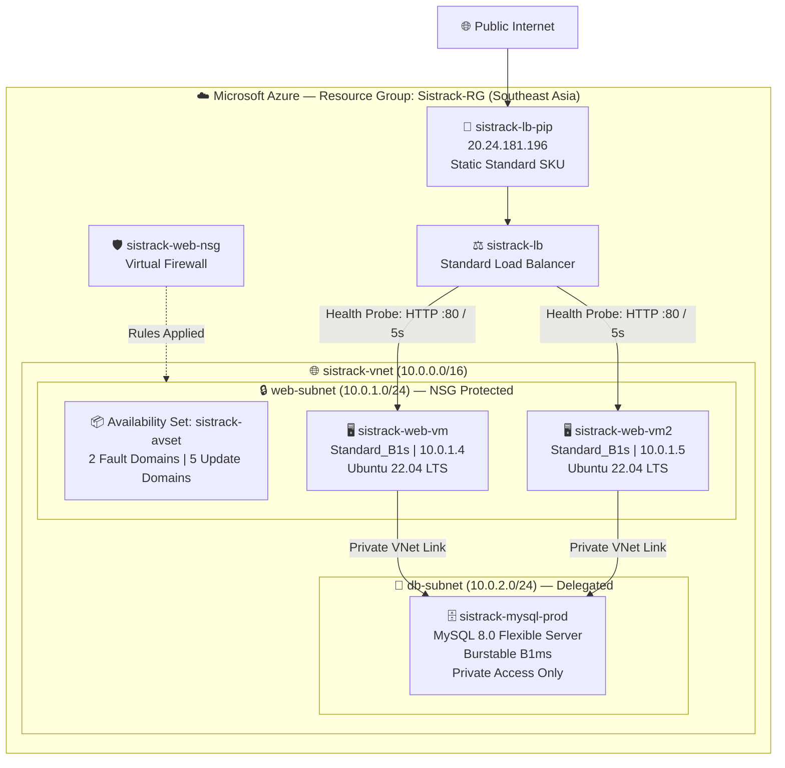
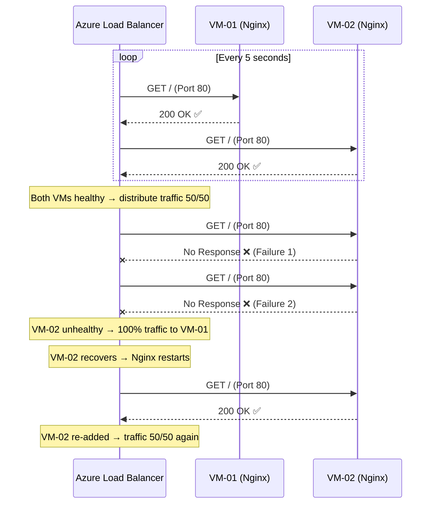
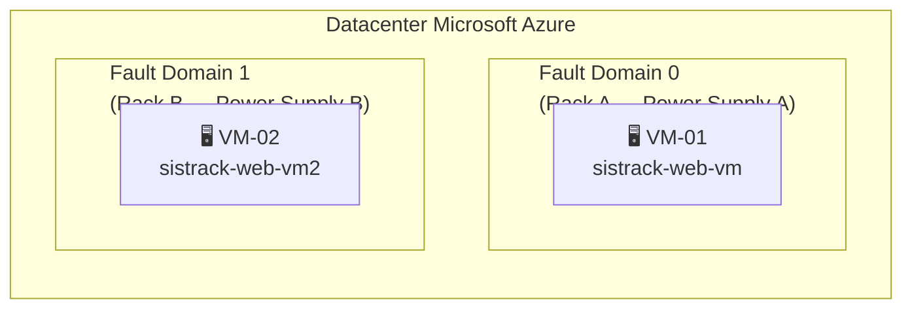

# Azure Cloud Architecture — SistrackV2 Enterprise

> **Document Version**: 3.0  
> **Last Updated**: June 2026  
> **Classification**: Confidential — Academic Final Project Deliverable  
> **Author**: Adam Yudhistira Muhtar  
> **Architecture Pattern**: Multi-VM Active-Active + Azure Standard Load Balancer + PaaS Database  
> **Cloud Provider**: Microsoft Azure (Azure for Students — Southeast Asia Region)

---

## Table of Contents

- [1. Architecture Overview](#1-architecture-overview)
- [2. Architecture Evolution](#2-architecture-evolution)
- [3. Final Target Architecture](#3-final-target-architecture)
- [4. Azure Resource Inventory](#4-azure-resource-inventory)
- [5. Resource Group Structure](#5-resource-group-structure)
- [6. Virtual Network Design](#6-virtual-network-design)
- [7. Subnet Design & Isolation](#7-subnet-design--isolation)
- [8. Public IP Strategy](#8-public-ip-strategy)
- [9. Azure Load Balancer Configuration](#9-azure-load-balancer-configuration)
- [10. Backend Pool Configuration](#10-backend-pool-configuration)
- [11. Health Probe Configuration](#11-health-probe-configuration)
- [12. Load Balancing Rules](#12-load-balancing-rules)
- [13. Network Security Group (NSG) Configuration](#13-network-security-group-nsg-configuration)
- [14. Availability Set Configuration](#14-availability-set-configuration)
- [15. Session Persistence Analysis](#15-session-persistence-analysis)
- [16. Load Balancer Verification Indicator](#16-load-balancer-verification-indicator)
- [17. Cost Estimation & Budget Analysis](#17-cost-estimation--budget-analysis)
- [18. Security Best Practices Matrix](#18-security-best-practices-matrix)
- [19. Cloud Service Model Justification](#19-cloud-service-model-justification)

---

## 1. Architecture Overview

SistrackV2 Enterprise menggunakan arsitektur **Multi-Tier Cloud (N-Tier)** pada Microsoft Azure, yang dirancang untuk memenuhi tiga pilar utama enterprise: **High Availability**, **Horizontal Scalability**, dan **Defense-in-Depth Security Isolation**.

Arsitektur ini terdiri dari tiga lapisan utama yang saling terisolasi secara logis:

| Layer | Komponen Azure | Fungsi Teknis |
| :--- | :--- | :--- |
| **Internet/Access Layer** | Azure Standard Load Balancer + Static Public IP | Penerima trafik publik dan penyeimbang beban komputasi secara stateless |
| **Compute Layer** | 2x Ubuntu 22.04 VM (Nginx + PM2 + Node.js 20 LTS) | Menjalankan Frontend statis dan 6 Backend Microservices secara identik |
| **Data Layer** | Azure Database for MySQL Flexible Server (PaaS) | Database terpusat terkelola dengan Private VNet Integration (zero public access) |

### Design Principles
1. **Shared-Nothing Architecture**: Setiap VM bersifat stateless. Tidak ada data sesi yang disimpan di RAM/disk VM.
2. **Active-Active Deployment**: Kedua VM melayani trafik secara simultan (bukan Active-Passive/Standby).
3. **Defense-in-Depth**: Tiga lapis keamanan — NSG Firewall, VNet Isolation, dan Private Database Access.
4. **Infrastructure-as-Documentation**: Seluruh konfigurasi didokumentasikan untuk replikasi dan audit.

---

## 2. Architecture Evolution

### Phase 1 — Single VM (Arsitektur Awal)

Pada fase awal pengembangan, seluruh stack aplikasi berjalan di satu VM tunggal dengan satu Public IP. Arsitektur ini memiliki kerentanan **Single Point of Failure (SPOF)** — jika VM mati, seluruh layanan terhenti.



**Kelemahan Fase 1:**
- ❌ Single Point of Failure (SPOF) pada level VM
- ❌ Tidak ada mekanisme failover otomatis
- ❌ Tidak memenuhi persyaratan High Availability Tugas Besar
- ❌ Maintenance/update menyebabkan downtime total

### Phase 2 — Multi-VM + Azure Load Balancer (Arsitektur Akhir)

Migrasi ke arsitektur Multi-VM mengeliminasi SPOF dengan mendistribusikan beban ke dua VM identik di belakang Azure Standard Load Balancer.



**Keunggulan Fase 2:**
- ✅ Eliminasi SPOF — jika satu VM mati, VM lain tetap melayani
- ✅ Zero-Downtime Failover dalam < 10 detik
- ✅ Rolling deployment tanpa gangguan layanan
- ✅ SLA 99.95% dijamin oleh Microsoft Azure

---

## 3. Final Target Architecture

Diagram arsitektur komprehensif yang menunjukkan seluruh komponen Azure dan hubungan antar-resource:



---

## 4. Azure Resource Inventory

Inventaris lengkap seluruh Azure resource yang digunakan dalam proyek:

| # | Resource Name | Resource Type | SKU / Tier | Region | Resource Group | Purpose |
| :---: | :--- | :--- | :--- | :--- | :--- | :--- |
| 1 | `Sistrack-RG` | Resource Group | — | Southeast Asia | — | Kontainer logis seluruh resource |
| 2 | `sistrack-vnet` | Virtual Network | — | Southeast Asia | Sistrack-RG | Jaringan privat terisolasi |
| 3 | `web-subnet` | Subnet | /24 (251 usable hosts) | — | Sistrack-RG | Compute tier (VM-01 & VM-02) |
| 4 | `db-subnet` | Subnet (Delegated) | /24 (251 usable hosts) | — | Sistrack-RG | Data tier (MySQL PaaS) |
| 5 | `sistrack-web-vm` | Virtual Machine | Standard_B1s | Southeast Asia | Sistrack-RG | Primary compute node |
| 6 | `sistrack-web-vm2` | Virtual Machine | Standard_B1s | Southeast Asia | Sistrack-RG | Secondary compute node |
| 7 | `sistrack-mysql-prod` | MySQL Flexible Server | Burstable B1ms | Southeast Asia | Sistrack-RG | Managed relational database |
| 8 | `sistrack-lb` | Load Balancer | Standard | Southeast Asia | Sistrack-RG | Traffic distribution |
| 9 | `sistrack-lb-pip` | Public IP Address | Standard, Static | Southeast Asia | Sistrack-RG | Single internet entry point |
| 10 | `sistrack-avset` | Availability Set | 2 FD / 5 UD | Southeast Asia | Sistrack-RG | Hardware fault isolation |
| 11 | `sistrack-web-nsg` | Network Security Group | — | Southeast Asia | Sistrack-RG | Virtual firewall rules |
| 12 | `sistrack-ssh-key` | SSH Key | RSA 4096 | Southeast Asia | Sistrack-RG | Secure remote access |

---

## 5. Resource Group Structure

```text
Sistrack-RG/
├── 🌐 Networking
│   ├── sistrack-vnet (10.0.0.0/16)
│   │   ├── web-subnet (10.0.1.0/24)
│   │   │   └── NSG: sistrack-web-nsg
│   │   └── db-subnet (10.0.2.0/24, Delegated to MySQL Flexible)
│   ├── sistrack-web-nsg (Inbound/Outbound Rules)
│   └── sistrack-lb-pip (20.24.181.196 — Static Standard)
│
├── 🖥️ Compute
│   ├── sistrack-avset (Availability Set — 2FD/5UD)
│   ├── sistrack-web-vm (VM-01)
│   │   ├── OS Disk: 30GB Premium SSD (P4)
│   │   ├── NIC: attached to web-subnet (10.0.1.4)
│   │   └── Public IP: None (via Load Balancer only)
│   └── sistrack-web-vm2 (VM-02)
│       ├── OS Disk: 30GB Premium SSD (P4)
│       ├── NIC: attached to web-subnet (10.0.1.5)
│       └── Public IP: None (completely isolated)
│
├── ⚖️ Load Balancing
│   └── sistrack-lb (Standard Load Balancer)
│       ├── Frontend IP: sistrack-lb-pip (20.24.181.196)
│       ├── Backend Pool: sistrack-backend-pool [VM-01, VM-02]
│       ├── Health Probe: sistrack-http-probe (HTTP :80 / 5s)
│       └── LB Rule: sistrack-http-rule (TCP 80→80)
│
├── 🗄️ Database
│   └── sistrack-mysql-prod (Azure MySQL Flexible Server)
│       ├── Engine: MySQL 8.0
│       ├── Compute: Burstable B1ms
│       ├── Storage: 20GB (Auto-grow enabled)
│       └── Networking: Private VNet Integration (zero public access)
│
└── 🔑 Security
    └── sistrack-ssh-key (RSA 4096-bit)
```

---

## 6. Virtual Network Design

| Parameter | Value |
| :--- | :--- |
| **VNet Name** | `sistrack-vnet` |
| **Address Space** | `10.0.0.0/16` (65,536 addresses) |
| **Region** | Southeast Asia |
| **DNS Servers** | Azure-provided (Default) |
| **Peering** | None (standalone VNet) |

Desain menggunakan **satu VNet tunggal** dengan **dua subnet terisolasi** untuk memisahkan *Compute Tier* dari *Data Tier*. Pendekatan ini menerapkan prinsip **Defense-in-Depth**: Database tidak pernah terekspos ke internet publik, dan hanya bisa diakses oleh VM dalam subnet yang diizinkan.

---

## 7. Subnet Design & Isolation

| Subnet Name | CIDR | Available Hosts | Purpose | Delegated | NSG Applied |
| :--- | :--- | :---: | :--- | :---: | :--- |
| `web-subnet` | `10.0.1.0/24` | 251 | VM-01, VM-02 (Compute) | No | `sistrack-web-nsg` |
| `db-subnet` | `10.0.2.0/24` | 251 | Azure MySQL (Data) | Yes (MySQL Flexible) | Managed by Azure |

### Isolation Principles:
1. **Network Segmentation**: VM di `web-subnet` berkomunikasi ke `db-subnet` melalui internal VNet routing. Namun, `db-subnet` **tidak memiliki jalur keluar ke internet** — tidak ada Public IP, tidak ada NAT Gateway.
2. **Delegation Model**: `db-subnet` didelegasikan sepenuhnya ke Azure MySQL Flexible Server, yang berarti Azure mengelola routing, DNS resolution, dan firewall rules secara otomatis.
3. **Attack Surface Minimization**: Karena database tidak bisa dijangkau dari internet, serangan SQL Injection dari luar jaringan menjadi mustahil secara topologis.

---

## 8. Public IP Strategy

### Before Migration (Single VM — Phase 1)
| Resource | IP Type | SKU | Assignment |
| :--- | :--- | :--- | :--- |
| `sistrack-web-vm-pip` | Public | Basic/Dynamic | Direct to VM-01 NIC |

### After Migration (Load Balanced — Phase 2)
| Resource | IP Type | SKU | Assignment |
| :--- | :--- | :--- | :--- |
| `sistrack-lb-pip` | Public | **Standard, Static** | Frontend IP of Load Balancer |
| VM-01 NIC | Private only | — | `10.0.1.4` (no public IP) |
| VM-02 NIC | Private only | — | `10.0.1.5` (no public IP) |

> **Implikasi Keamanan**: Setelah migrasi ke Load Balancer, **kedua VM tidak lagi memiliki Public IP**. Ini berarti VM tidak bisa di-SSH langsung dari internet — akses remote hanya bisa melalui Azure Bastion, Jump Host, atau VPN. Serangan brute-force SSH dari internet menjadi secara topologis tidak mungkin.

---

## 9. Azure Load Balancer Configuration

| Parameter | Value | Justification |
| :--- | :--- | :--- |
| **Name** | `sistrack-lb` | Konvensi naming: `{project}-lb` |
| **SKU** | Standard | Wajib untuk Availability Set & advanced features |
| **Type** | Public | Menerima trafik dari internet |
| **Frontend IP** | `sistrack-lb-pip` (Static) | IP tidak berubah saat VM restart |
| **Region** | Southeast Asia | Meminimalisir latensi ke Indonesia |

### Why Standard SKU (bukan Basic)?
1. **Compatibility**: Azure Standard LB **wajib** digunakan bersama VMs di Availability Set.
2. **Features**: Mendukung Health Probes HTTP, multiple backend pools, dan cross-zone balancing.
3. **SLA**: Microsoft menjamin **99.99% availability** untuk Standard LB.
4. **Security**: Standard SKU default menolak semua trafik inbound — hanya trafik yang secara eksplisit diizinkan oleh NSG yang diperbolehkan.

---

## 10. Backend Pool Configuration

| Parameter | Value |
| :--- | :--- |
| **Pool Name** | `sistrack-backend-pool` |
| **Associated To** | Availability Set (`sistrack-avset`) |
| **Configuration Mode** | NIC-based (IP Configuration) |

| VM Member | Hostname | Private IP | NIC | Status |
| :--- | :--- | :--- | :--- | :--- |
| `sistrack-web-vm` | VM-01 | `10.0.1.4` | `sistrack-web-vmVMNic` | Active Member |
| `sistrack-web-vm2` | VM-02 | `10.0.1.5` | `sistrack-web-vm2VMNic` | Active Member |

Kedua VM di-register ke dalam satu Backend Pool. Load Balancer mendistribusikan trafik masuk secara merata (**50/50 split**) selama kedua VM healthy.

---

## 11. Health Probe Configuration

| Parameter | Value |
| :--- | :--- |
| **Probe Name** | `sistrack-http-probe` |
| **Protocol** | HTTP |
| **Port** | 80 |
| **Path** | `/` |
| **Interval** | 5 seconds |
| **Unhealthy Threshold** | 2 consecutive failures |

### Mechanism Deep-Dive

Setiap 5 detik, Azure Load Balancer mengirim HTTP GET ke `http://<VM-IP>:80/` pada setiap VM. Jika Nginx merespons HTTP 200, VM dianggap **healthy**. Jika gagal 2 kali berturut-turut (10 detik total), VM dikeluarkan dari rotasi hingga pulih.



---

## 12. Load Balancing Rules

| Parameter | Value |
| :--- | :--- |
| **Rule Name** | `sistrack-http-rule` |
| **Frontend IP** | `sistrack-lb-pip` |
| **Protocol** | TCP |
| **Frontend Port** | 80 |
| **Backend Port** | 80 |
| **Backend Pool** | `sistrack-backend-pool` |
| **Health Probe** | `sistrack-http-probe` |
| **Session Persistence** | None (Stateless Distribution) |
| **Idle Timeout** | 4 minutes |
| **Floating IP** | Disabled |
| **TCP Reset on Idle** | Enabled |

### Traffic Distribution Algorithm — 5-Tuple Hash

Azure Standard Load Balancer menggunakan algoritma **5-tuple hash** secara default untuk distribusi trafik:

```text
Hash_Key = f(Source_IP, Source_Port, Destination_IP, Destination_Port, Protocol)
```

| Tuple | Description |
| :--- | :--- |
| Source IP | IP address klien yang melakukan request |
| Source Port | Port ephemeral klien (random) |
| Destination IP | IP Load Balancer (20.24.181.196) |
| Destination Port | Port 80 (HTTP) |
| Protocol | TCP |

**Implikasi**: Setiap koneksi TCP baru menghasilkan hash baru, sehingga trafik didistribusikan secara **statistically even** di antara VM-01 dan VM-02. Ini memaksimalkan utilisasi sumber daya dan menghindari hotspot.

---

## 13. Network Security Group (NSG) Configuration

### `sistrack-web-nsg` (Applied to web-subnet)

#### Inbound Rules (Internet → VM)

| Priority | Name | Port | Protocol | Source | Destination | Action | Justification |
| :---: | :--- | :--- | :--- | :--- | :--- | :--- | :--- |
| 100 | `Allow-HTTP` | 80 | TCP | Any | Any | **Allow** | Web traffic dari Load Balancer |
| 110 | `Allow-HTTPS` | 443 | TCP | Any | Any | **Allow** | Future SSL/TLS termination |
| 120 | `Allow-SSH` | 22 | TCP | Trusted IP / Bastion | Any | **Allow** | Remote management (restricted) |
| 130 | `Allow-LB-Probe` | Any | Any | AzureLoadBalancer | Any | **Allow** | Health probe dari LB (168.63.129.16) |
| 65000 | `DenyAllInbound` | Any | Any | Any | Any | **Deny** | Default deny-all (zero trust) |

#### Outbound Rules (VM → External)

| Priority | Name | Port | Protocol | Source | Destination | Action | Justification |
| :---: | :--- | :--- | :--- | :--- | :--- | :--- | :--- |
| 100 | `Allow-MySQL` | 3306 | TCP | web-subnet | db-subnet | **Allow** | Database connectivity |
| 110 | `Allow-Internet` | Any | TCP | Any | Internet | **Allow** | OS updates, npm packages |

> **CRITICAL**: Rule `Allow-LB-Probe` (Priority 130) adalah **WAJIB**. Tanpa rule ini, Health Probe dari Azure Load Balancer (source IP: `168.63.129.16`) akan ditolak oleh NSG, menyebabkan **semua VM dianggap unhealthy** dan trafik terhenti total.

---

## 14. Availability Set Configuration

| Parameter | Value |
| :--- | :--- |
| **Name** | `sistrack-avset` |
| **Fault Domains (FD)** | 2 |
| **Update Domains (UD)** | 5 |
| **Managed Disks** | Yes (Aligned) |

### Mengapa Availability Set?



1. **Fault Domains (FD = 2)**: VM-01 dan VM-02 ditempatkan pada **rak server fisik yang berbeda** dengan sirkuit listrik dan switch jaringan independen. Jika Rack A terbakar atau mengalami gangguan listrik, Rack B tetap beroperasi normal.
2. **Update Domains (UD = 5)**: Saat Azure melakukan pemeliharaan host (*host maintenance / patching*), hanya satu Update Domain yang di-reboot pada satu waktu. Minimal satu VM selalu aktif melayani trafik.
3. **SLA Guarantee**: Dengan konfigurasi Availability Set + Standard LB, Microsoft menjamin **99.95% uptime SLA** (~4.38 jam downtime maksimal per tahun).

---

## 15. Session Persistence Analysis

### Apakah SistrackV2 Membutuhkan Sticky Sessions?

| Aspek | Analisis Teknis | Membutuhkan Sticky Session? |
| :--- | :--- | :--- |
| **Autentikasi Admin** | JWT Token di header `Authorization`. Token bersifat self-contained (berisi payload + signature). Validasi terjadi di CPU, bukan di disk/RAM. | ❌ Tidak |
| **Sesi Pelanggan** | JWT Token di header `X-Session-Token`. Stateless — token bisa divalidasi oleh VM manapun. | ❌ Tidak |
| **State Management** | Semua state (orders, seats, products) disimpan di Azure MySQL (shared database). Zero in-memory session. | ❌ Tidak |
| **Frontend Assets** | File statis (HTML/JS/CSS) identik di `/var/www/sistrack/frontend/dist` pada semua VM. | ❌ Tidak |
| **Socket.IO** | WebSocket connections bersifat persistent per-VM. Notification adalah broadcast event. | ⚠️ Minor |

**Kesimpulan**: Arsitektur SistrackV2 sepenuhnya **stateless** di sisi server. Session Persistence **tidak diperlukan**. Distribusi **Round-Robin / 5-Tuple Hash** (tanpa sticky session) adalah pilihan optimal karena memaksimalkan distribusi beban.

---

## 16. Load Balancer Verification Indicator

Untuk **membuktikan kepada dosen** bahwa Load Balancer benar-benar mendistribusikan trafik ke VM yang berbeda, aplikasi frontend dilengkapi **Server Identification Badge** — sebuah label visual di pojok kanan bawah layar yang menampilkan nama VM yang sedang melayani request.

### Mekanisme Teknis:
1. Saat melakukan `npm run build` di setiap VM, variabel environment `VITE_APP_SERVER_ID` di-set berbeda:
   - **VM-01**: `export VITE_APP_SERVER_ID="VM-01" && npm run build`
   - **VM-02**: `export VITE_APP_SERVER_ID="VM-02" && npm run build`
2. Komponen `App.vue` membaca variabel ini dan menampilkan badge floating.
3. Ketika dosen me-refresh browser atau membuka Incognito mode, badge akan berubah antara **VM-01** dan **VM-02**.

### Bukti Visual:
- Saat trafik diarahkan ke VM-01: Badge menampilkan `🖥️ VM-01`
- Saat trafik diarahkan ke VM-02: Badge menampilkan `🖥️ VM-02`
- Perubahan ini terjadi karena 5-tuple hash menghasilkan hash berbeda untuk setiap koneksi TCP baru.

---

## 17. Cost Estimation & Budget Analysis

| Resource | SKU | Monthly Cost (Est.) | Notes |
| :--- | :--- | :--- | :--- |
| VM-01 (`Standard_B1s`) | Burstable | **$0.00** | 750 hrs/mo free tier (Azure for Students) |
| VM-02 (`Standard_B1s`) | Burstable | **~$7.59** | Pay-as-you-go after free tier |
| Azure MySQL Flexible (`B1ms`) | Burstable | **~$6.21** | Development/test tier |
| Standard Load Balancer | Per-rule + data processed | **~$18.25** | 1 LB rule, minimal data |
| Public IP (Standard, Static) | Per-hour | **~$3.65** | 1 static IP for LB |
| Managed Disks (2x 30GB P4) | Premium SSD | **~$9.60** | OS disks for both VMs |
| **TOTAL** | | **~$45.30/month** | |

> **Azure for Students**: Kredit gratis **$100**. Arsitektur ini dapat berjalan selama **~2+ bulan penuh** tanpa biaya. Lebih dari cukup untuk periode pengembangan dan demo Tugas Besar.

---

## 18. Security Best Practices Matrix

| Security Domain | Implementation | Status |
| :--- | :--- | :--- |
| **Network Isolation** | VNet dengan subnet terpisah (Compute vs Data) | ✅ Implemented |
| **Private Database** | Azure MySQL: zero public endpoint, VNet-only access | ✅ Implemented |
| **SSH Key Authentication** | Password login dinonaktifkan. RSA 4096-bit key pair only | ✅ Implemented |
| **NSG Least Privilege** | Default deny-all. Hanya Port 80, 443, 22 yang terbuka | ✅ Implemented |
| **No Direct VM Access** | Kedua VM tidak memiliki Public IP. Akses hanya via LB | ✅ Implemented |
| **Helmet.js** | HTTP Security Headers (XSS, MIME Sniffing, Clickjacking) | ✅ Implemented |
| **Rate Limiting** | 3-tier rate limiter di API Gateway | ✅ Implemented |
| **JWT Stateless Auth** | HMAC SHA-256 token, tidak perlu shared session store | ✅ Implemented |
| **No Root Login** | SSH menggunakan user `azureuser`, bukan root | ✅ Implemented |
| **DDoS Protection** | Azure DDoS Protection Basic (included with Standard LB) | ✅ Included |

---

## 19. Cloud Service Model Justification

### Mengapa PaaS Database (bukan VM Database)?

Persyaratan Tugas Besar menyebutkan "Database Server". Proyek ini menggunakan **Azure Database for MySQL Flexible Server** (PaaS) — bukan VM terpisah yang menjalankan MySQL secara manual (IaaS).

| Aspek | IaaS (VM Database) | PaaS (Azure MySQL Flexible) | Winner |
| :--- | :--- | :--- | :--- |
| **Maintenance** | Manual: OS patching, MySQL updates, backup scripts | Otomatis: Azure mengelola semuanya | ✅ PaaS |
| **High Availability** | Harus setup replication manual | Built-in automatic failover | ✅ PaaS |
| **Backup & Recovery** | Cron job + mysqldump manual | Point-in-Time Restore (7 hari) | ✅ PaaS |
| **Security** | Harus hardening OS, firewall manual | VNet Integration, managed firewall | ✅ PaaS |
| **Cost** | VM + Disk + IP = lebih mahal | Single managed service = lebih murah | ✅ PaaS |
| **Compliance** | Memenuhi "Database Server" | Memenuhi "Database Server" (lebih advanced) | ✅ PaaS |

**Justifikasi Akademik**: Dalam paradigma Cloud Computing modern, mendelegasikan manajemen database ke layanan PaaS merupakan **industry best practice**. Pendekatan ini menghilangkan operational overhead dan memungkinkan tim engineering untuk fokus pada pengembangan aplikasi, bukan administrasi sistem. Azure MySQL Flexible Server tetap memenuhi persyaratan "Database Server" karena secara fungsional menyediakan dedicated database endpoint yang terisolasi dalam private network.

---

<div align="center">
  <b>SisTrackV2 Enterprise</b> &copy; 2026 Adam Yudhistira Muhtar. All Rights Reserved.<br>
  <i>Confidential & Proprietary Architecture Documentation.</i>
</div>
