# Deployment Guide — SistrackV2 Azure Load Balancer Migration

> **Panduan ini membimbing Anda step-by-step dari arsitektur Single-VM ke Multi-VM + Azure Load Balancer.**  
> **Prerequisite**: Anda sudah memiliki VM-01 (`sistrack-web-vm`) yang berjalan dengan Nginx + PM2.

---

## Table of Contents

- [Phase 1 — Pre-Migration Checklist](#phase-1--pre-migration-checklist)
- [Phase 2 — Create Availability Set](#phase-2--create-availability-set)
- [Phase 3 — Create VM-02 (Replica)](#phase-3--create-vm-02-replica)
- [Phase 4 — Deploy Application to VM-02](#phase-4--deploy-application-to-vm-02)
- [Phase 5 — Create Azure Load Balancer](#phase-5--create-azure-load-balancer)
- [Phase 6 — Configure Load Balancer Components](#phase-6--configure-load-balancer-components)
- [Phase 7 — NSG Adjustment for Health Probes](#phase-7--nsg-adjustment-for-health-probes)
- [Phase 8 — DNS & IP Migration](#phase-8--dns--ip-migration)
- [Phase 9 — Validation & Testing](#phase-9--validation--testing)
- [Phase 10 — Rollback Plan](#phase-10--rollback-plan)

---

## Phase 1 — Pre-Migration Checklist

Sebelum memulai migrasi, verifikasi kondisi infrastruktur saat ini:

| # | Item | Command / Check | Expected Result |
| :---: | :--- | :--- | :--- |
| 1 | VM-01 berjalan | Azure Portal → VM → Status | `Running` |
| 2 | Nginx aktif | `sudo systemctl status nginx` | `active (running)` |
| 3 | PM2 processes online | `pm2 status` | 6 apps `online` |
| 4 | Database accessible | `mysql -h <DB_HOST> -u sistrack_admin -p -e "SHOW DATABASES;"` | `sistrackv2` listed |
| 5 | Website accessible | Browser → `http://<VM-IP>` | SistrackV2 UI loads |
| 6 | Note VM-01 Public IP | Azure Portal → VM → Overview → Public IP | Record this IP |

> ⚠️ **PENTING**: Catat IP Public VM-01 saat ini. IP ini akan berubah setelah migrasi ke Load Balancer.

---

## Phase 2 — Create Availability Set

Availability Set memastikan VM-01 dan VM-02 ditempatkan pada rak fisik berbeda di datacenter Azure.

### Azure Portal
1. Buka **Azure Portal** → Search → `Availability Sets` → **+ Create**
2. Konfigurasi:
   - **Resource Group**: `Sistrack-RG`
   - **Name**: `sistrack-avset`
   - **Region**: `Southeast Asia`
   - **Fault Domains**: `2`
   - **Update Domains**: `5`
   - **Use managed disks**: `Yes (Aligned)`
3. Klik **Review + create** → **Create**

### Azure CLI (Alternatif)
```bash
az vm availability-set create \
  --resource-group Sistrack-RG \
  --name sistrack-avset \
  --platform-fault-domain-count 2 \
  --platform-update-domain-count 5 \
  --location southeastasia
```

> **Catatan**: VM-01 yang sudah ada harus di-*deallocate* terlebih dahulu untuk dipindahkan ke Availability Set. Jika ini terlalu beresiko, Anda bisa membuat VM-01 baru di dalam Availability Set dan memindahkan data.

---

## Phase 3 — Create VM-02 (Replica)

### Azure Portal
1. **Virtual Machines** → **+ Create** → **Azure Virtual Machine**
2. Konfigurasi **Basics**:
   - **Resource Group**: `Sistrack-RG`
   - **Virtual machine name**: `sistrack-web-vm2`
   - **Region**: `Southeast Asia`
   - **Availability options**: **Availability Set** → pilih `sistrack-avset`
   - **Image**: `Ubuntu Server 22.04 LTS - x64 Gen2`
   - **Size**: `Standard_B1s`
   - **Authentication**: SSH public key
   - **Username**: `azureuser`
   - **Key pair**: Gunakan key yang sama (`sistrack-ssh-key`) atau buat baru
3. Konfigurasi **Networking**:
   - **Virtual network**: `sistrack-vnet`
   - **Subnet**: `web-subnet`
   - **Public IP**: **None** (VM-02 hanya diakses via Load Balancer)
   - **NIC NSG**: `sistrack-web-nsg`
4. Klik **Review + create** → **Create**

### Azure CLI (Alternatif)
```bash
az vm create \
  --resource-group Sistrack-RG \
  --name sistrack-web-vm2 \
  --image Canonical:0001-com-ubuntu-server-jammy:22_04-lts-gen2:latest \
  --size Standard_B1s \
  --availability-set sistrack-avset \
  --vnet-name sistrack-vnet \
  --subnet web-subnet \
  --nsg sistrack-web-nsg \
  --public-ip-address "" \
  --admin-username azureuser \
  --ssh-key-values ~/.ssh/sistrack-ssh-key.pub \
  --location southeastasia
```

---

## Phase 4 — Deploy Application to VM-02

Karena VM-02 tidak memiliki Public IP, akses via **SSH Jump** melalui VM-01:

### 4.1 SSH ke VM-02 via VM-01 (Jump Host)
```bash
# Dari laptop Anda, SSH ke VM-01 terlebih dahulu
ssh -i sistrack-ssh-key.pem azureuser@<VM-01-PUBLIC-IP>

# Dari dalam VM-01, SSH ke VM-02 menggunakan Private IP
ssh azureuser@10.0.1.5
```

> **Alternatif**: Gunakan **Azure Bastion** untuk SSH langsung ke VM-02 tanpa public IP.

### 4.2 Install Software Stack (di VM-02)
```bash
# 1. Update OS
sudo apt update && sudo apt upgrade -y

# 2. Install Nginx, Git, MySQL Client
sudo apt install nginx git mysql-client -y

# 3. Install Node.js 20 via NVM
curl -o- https://raw.githubusercontent.com/nvm-sh/nvm/v0.39.7/install.sh | bash
source ~/.bashrc
nvm install 20

# 4. Install PM2
npm install -g pm2
```

### 4.3 Clone & Setup Application (di VM-02)
```bash
# 1. Clone repository
sudo mkdir -p /var/www/sistrack
sudo chown -R azureuser:azureuser /var/www/sistrack
cd /var/www/sistrack
git clone https://github.com/adamyudhistiramuhtar-byte/SistrackV2.git .

# 2. Install dependencies & build frontend
cd frontend && npm install && npm run build && cd ..
npm install
cd backend && npm install
for dir in */; do (cd "$dir" && npm install); done
cd ..
```

### 4.4 Copy Environment File dari VM-01
```bash
# Dari VM-01, copy file .env ke VM-02
scp /var/www/sistrack/backend/gateway/.env azureuser@10.0.1.5:/var/www/sistrack/backend/gateway/.env
```

Atau buat manual di VM-02:
```bash
nano /var/www/sistrack/backend/gateway/.env
```
Paste isi `.env` yang identik dengan VM-01 (DB_HOST, JWT_SECRET, dll tetap sama karena mengarah ke database yang sama).

### 4.5 Copy Nginx Configuration dari VM-01
```bash
# Dari VM-01, copy Nginx config
scp /etc/nginx/sites-available/sistrack azureuser@10.0.1.5:/tmp/sistrack-nginx

# Di VM-02, pasang config
sudo mv /tmp/sistrack-nginx /etc/nginx/sites-available/sistrack
sudo rm -f /etc/nginx/sites-enabled/default
sudo ln -sf /etc/nginx/sites-available/sistrack /etc/nginx/sites-enabled/
sudo nginx -t && sudo systemctl restart nginx
```

### 4.6 Start PM2 Services (di VM-02)
```bash
cd /var/www/sistrack
npm run start
pm2 save
pm2 startup
# Copy-paste output 'sudo env PATH...' yang muncul, lalu jalankan
```

### 4.7 Verify VM-02 Operational
```bash
# Nginx harus merespons
curl http://localhost

# Health check endpoint
curl http://localhost/api/health

# PM2 harus menunjukkan 6 apps online
pm2 status
```

---

## Phase 5 — Create Azure Load Balancer

### Azure Portal
1. Search → `Load Balancers` → **+ Create**
2. Konfigurasi **Basics**:
   - **Resource Group**: `Sistrack-RG`
   - **Name**: `sistrack-lb`
   - **Region**: `Southeast Asia`
   - **SKU**: **Standard**
   - **Type**: **Public**
   - **Tier**: **Regional**
3. Konfigurasi **Frontend IP**:
   - **Name**: `sistrack-frontend-ip`
   - **Public IP address**: **Create new** → `sistrack-lb-pip`
   - **Assignment**: **Static**
   - **SKU**: **Standard**
4. Konfigurasi **Backend pools**:
   - **Name**: `sistrack-backend-pool`
   - **Virtual network**: `sistrack-vnet`
   - **Backend Pool Configuration**: **NIC**
   - **Add**: pilih `sistrack-web-vm` dan `sistrack-web-vm2`
5. Konfigurasi **Inbound rules** → **Add a load balancing rule**:
   - **Name**: `sistrack-http-rule`
   - **Frontend IP**: `sistrack-frontend-ip`
   - **Protocol**: `TCP`
   - **Port**: `80`
   - **Backend port**: `80`
   - **Backend pool**: `sistrack-backend-pool`
   - **Health probe**: **Create new**
     - **Name**: `sistrack-http-probe`
     - **Protocol**: `HTTP`
     - **Port**: `80`
     - **Path**: `/`
     - **Interval**: `5`
     - **Unhealthy threshold**: `2`
   - **Session persistence**: `None`
   - **Idle timeout**: `4 minutes`
6. Klik **Review + create** → **Create**

### Azure CLI (Alternatif — Full Script)
```bash
# 1. Create Public IP for LB
az network public-ip create \
  --resource-group Sistrack-RG \
  --name sistrack-lb-pip \
  --sku Standard \
  --allocation-method Static \
  --location southeastasia

# 2. Create Load Balancer
az network lb create \
  --resource-group Sistrack-RG \
  --name sistrack-lb \
  --sku Standard \
  --public-ip-address sistrack-lb-pip \
  --frontend-ip-name sistrack-frontend-ip \
  --backend-pool-name sistrack-backend-pool \
  --location southeastasia

# 3. Create Health Probe
az network lb probe create \
  --resource-group Sistrack-RG \
  --lb-name sistrack-lb \
  --name sistrack-http-probe \
  --protocol Http \
  --port 80 \
  --path "/" \
  --interval 5 \
  --threshold 2

# 4. Create Load Balancing Rule
az network lb rule create \
  --resource-group Sistrack-RG \
  --lb-name sistrack-lb \
  --name sistrack-http-rule \
  --protocol Tcp \
  --frontend-port 80 \
  --backend-port 80 \
  --frontend-ip-name sistrack-frontend-ip \
  --backend-pool-name sistrack-backend-pool \
  --probe-name sistrack-http-probe \
  --idle-timeout 4 \
  --enable-tcp-reset true

# 5. Add VM NICs to Backend Pool
az network nic ip-config address-pool add \
  --resource-group Sistrack-RG \
  --nic-name sistrack-web-vmVMNic \
  --ip-config-name ipconfig1 \
  --lb-name sistrack-lb \
  --address-pool sistrack-backend-pool

az network nic ip-config address-pool add \
  --resource-group Sistrack-RG \
  --nic-name sistrack-web-vm2VMNic \
  --ip-config-name ipconfig1 \
  --lb-name sistrack-lb \
  --address-pool sistrack-backend-pool
```

---

## Phase 6 — Configure Load Balancer Components

### 6.1 Verify Backend Pool Health
1. Azure Portal → `sistrack-lb` → **Backend pools** → `sistrack-backend-pool`
2. Pastikan kedua VM menunjukkan status **Healthy** (ikon hijau).

### 6.2 Update CORS / ALLOWED_ORIGINS
Karena IP Public berubah (sekarang menggunakan IP LB), update `.env` di **kedua VM**:
```bash
# SSH ke VM-01 dan VM-02, edit .env:
nano /var/www/sistrack/backend/gateway/.env

# Ubah ALLOWED_ORIGINS ke IP Load Balancer yang baru:
ALLOWED_ORIGINS=http://<LOAD-BALANCER-PUBLIC-IP>

# Restart PM2 di kedua VM
cd /var/www/sistrack && pm2 restart all
```

---

## Phase 7 — NSG Adjustment for Health Probes

Health Probe dari Azure Load Balancer menggunakan source IP `168.63.129.16`. NSG harus mengizinkan trafik ini.

```bash
# Add NSG rule to allow Azure LB health probes
az network nsg rule create \
  --resource-group Sistrack-RG \
  --nsg-name sistrack-web-nsg \
  --name Allow-LB-Probe \
  --priority 130 \
  --source-address-prefixes AzureLoadBalancer \
  --destination-port-ranges "*" \
  --access Allow \
  --protocol "*" \
  --direction Inbound
```

Atau via Azure Portal:
1. **Network security groups** → `sistrack-web-nsg` → **Inbound security rules** → **+ Add**
2. Source: **Service Tag** → `AzureLoadBalancer`
3. Destination port ranges: `*`
4. Action: **Allow**
5. Priority: `130`
6. Name: `Allow-LB-Probe`

---

## Phase 8 — DNS & IP Migration

### Jika Menggunakan IP Langsung (Tanpa Domain)
Setelah Load Balancer aktif, catat IP baru:
```bash
az network public-ip show \
  --resource-group Sistrack-RG \
  --name sistrack-lb-pip \
  --query ipAddress \
  --output tsv
```
Gunakan IP ini untuk mengakses aplikasi di browser.

### Jika Menggunakan Domain (Opsional)
Ubah **A Record** domain Anda dari IP VM lama ke IP Load Balancer baru:
```
Type: A
Name: @ (atau sistrack)
Value: <LOAD-BALANCER-PUBLIC-IP>
TTL: 300
```

### SSL/TLS Preservation
Jika sebelumnya menggunakan Let's Encrypt (Certbot) di VM-01:
1. Certificate files tersimpan di `/etc/letsencrypt/` di VM-01
2. Copy certificate ke VM-02:
   ```bash
   # Dari VM-01
   sudo scp -r /etc/letsencrypt/ azureuser@10.0.1.5:/tmp/letsencrypt/
   
   # Di VM-02
   sudo mv /tmp/letsencrypt/ /etc/letsencrypt/
   sudo nginx -t && sudo systemctl restart nginx
   ```
3. Pastikan Nginx config di kedua VM identik (termasuk blok `ssl_certificate`)
4. Tambahkan LB Rule untuk HTTPS:
   ```bash
   az network lb rule create \
     --resource-group Sistrack-RG \
     --lb-name sistrack-lb \
     --name sistrack-https-rule \
     --protocol Tcp \
     --frontend-port 443 \
     --backend-port 443 \
     --frontend-ip-name sistrack-frontend-ip \
     --backend-pool-name sistrack-backend-pool \
     --probe-name sistrack-http-probe
   ```

---

## Phase 9 — Validation & Testing

### 9.1 Validation Checklist

| # | Test | Command / Action | Expected |
| :---: | :--- | :--- | :--- |
| 1 | LB Public IP accessible | Browser → `http://<LB-IP>` | SistrackV2 UI loads |
| 2 | Backend Pool healthy | Azure Portal → LB → Backend pools | Both VMs green ✅ |
| 3 | API responds | `curl http://<LB-IP>/api/products/available` | JSON product list |
| 4 | Admin login works | Browser → `http://<LB-IP>/admin/login` | Login form appears |
| 5 | Order creation works | Browser → Select seat → Add items → Checkout | Order created successfully |
| 6 | Real-time notification | Create order → Check admin dashboard | Order appears in real-time |
| 7 | Health probe logs | Azure Portal → LB → Metrics → Health Probe Status | 100% for both VMs |

### 9.2 Failover Test

Untuk membuktikan High Availability, simulasikan kegagalan satu VM:

```bash
# 1. Di VM-02, matikan Nginx sementara
sudo systemctl stop nginx

# 2. Tunggu ~10 detik (2x interval probe = 10s)

# 3. Di browser, refresh http://<LB-IP>
# → Harus tetap bisa diakses (VM-01 menangani semua trafik)

# 4. Di Azure Portal → LB → Metrics → Health Probe Status
# → VM-02 akan menunjukkan 0% (unhealthy), VM-01 100%

# 5. Hidupkan kembali VM-02
sudo systemctl start nginx

# 6. Dalam ~10 detik, VM-02 kembali ke rotasi (healthy)
```

### 9.3 Load Distribution Test

```bash
# Dari laptop Anda, jalankan multiple requests
for i in {1..20}; do curl -s http://<LB-IP>/api/health | jq '.'; done

# Atau gunakan browser Developer Tools → Network tab
# Refresh berulang kali dan perhatikan response pattern
```

---

## Phase 10 — Rollback Plan

Jika terjadi masalah kritis setelah migrasi:

### Emergency Rollback Steps
```bash
# 1. Re-assign Public IP langsung ke VM-01
az network nic ip-config update \
  --resource-group Sistrack-RG \
  --nic-name sistrack-web-vmVMNic \
  --name ipconfig1 \
  --public-ip-address sistrack-web-vm-pip

# 2. Jika menggunakan domain, ubah A Record kembali ke IP VM-01

# 3. Verify VM-01 masih berjalan normal
curl http://<VM-01-PUBLIC-IP>
pm2 status
```

### Rollback Checklist

| # | Step | Status |
| :---: | :--- | :--- |
| 1 | Re-assign Public IP ke VM-01 | ☐ |
| 2 | Update DNS A Record (jika pakai domain) | ☐ |
| 3 | Verify website accessible via VM-01 IP | ☐ |
| 4 | Remove LB backend pool members | ☐ |
| 5 | Delete Load Balancer (opsional) | ☐ |
| 6 | Document rollback reason | ☐ |

---

## Zero-Downtime Migration Strategy

Untuk memastikan **zero-downtime** selama migrasi:

```mermaid
gantt
    title Migration Timeline
    dateFormat  HH:mm
    axisFormat  %H:%M
    
    section Phase A - Preparation
    Create Availability Set & VM-02  :a1, 00:00, 30min
    Deploy app to VM-02              :a2, after a1, 30min
    Verify VM-02 works locally       :a3, after a2, 10min
    
    section Phase B - LB Setup
    Create LB + Backend Pool         :b1, after a3, 15min
    Add VM-01 to Backend Pool        :b2, after b1, 5min
    Add VM-02 to Backend Pool        :b3, after b2, 5min
    Configure Health Probe           :b4, after b3, 5min
    
    section Phase C - Cutover
    Update DNS/IP to LB              :c1, after b4, 5min
    Verify via LB IP                 :c2, after c1, 10min
    Remove old VM-01 Public IP       :c3, after c2, 5min
    
    section Phase D - Validation
    Full validation tests            :d1, after c3, 20min
    Failover test                    :d2, after d1, 10min
```



**Total estimated migration time**: ~2.5 jam (dengan validasi menyeluruh).
