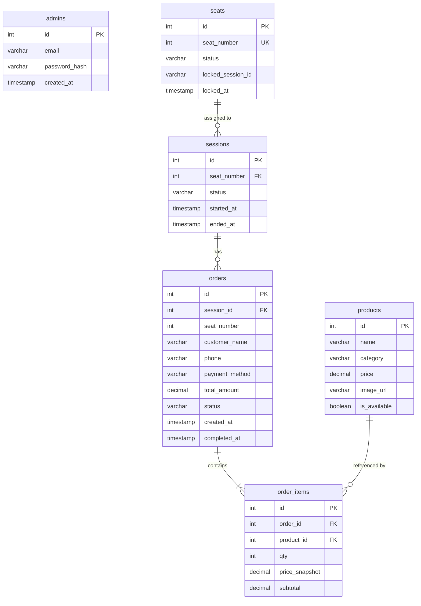
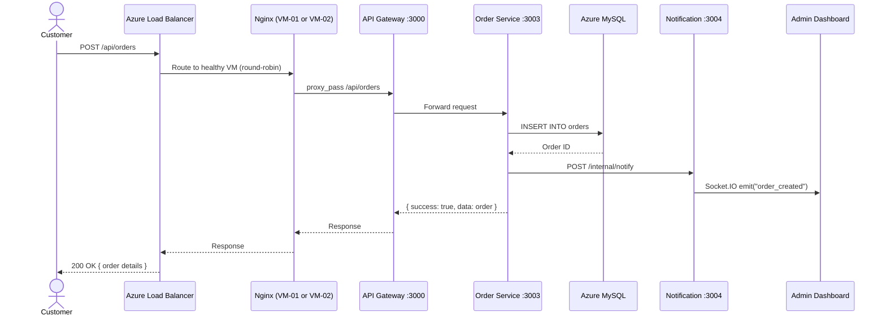
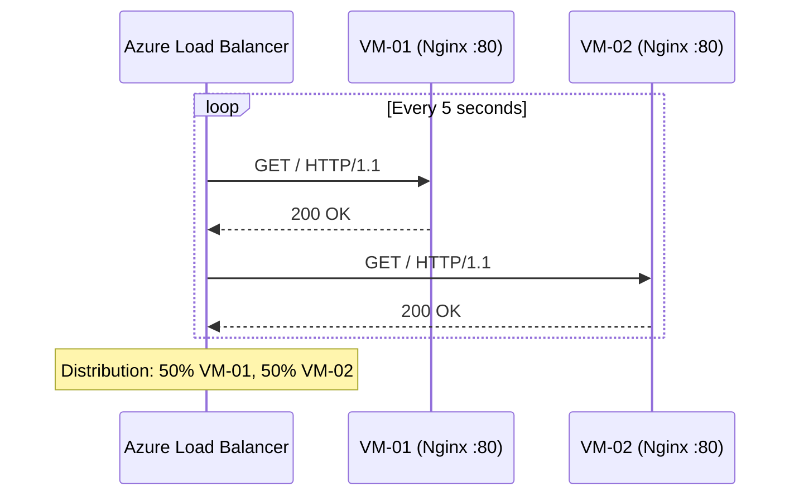
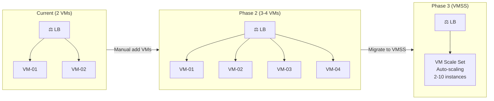

# Infrastructure Reference — SistrackV2 Cloud Environment

> **Dokumen ini menyediakan referensi teknis lengkap untuk seluruh infrastruktur cloud SistrackV2.**

---

## Table of Contents

- [1. VM Configuration Matrix](#1-vm-configuration-matrix)
- [2. Software Stack per VM](#2-software-stack-per-vm)
- [3. Port Mapping](#3-port-mapping)
- [4. Nginx Configuration Reference](#4-nginx-configuration-reference)
- [5. PM2 Process Inventory](#5-pm2-process-inventory)
- [6. Database Schema Reference](#6-database-schema-reference)
- [7. Environment Variables Reference](#7-environment-variables-reference)
- [8. Network Flow Diagram](#8-network-flow-diagram)
- [9. Azure Monitor Integration](#9-azure-monitor-integration)
- [10. Logging Architecture](#10-logging-architecture)
- [11. Backup Strategy](#11-backup-strategy)
- [12. Future Scaling Strategy](#12-future-scaling-strategy)

---

## 1. VM Configuration Matrix

| Property | VM-01 (sistrack-web-vm) | VM-02 (sistrack-web-vm2) |
| :--- | :--- | :--- |
| **OS** | Ubuntu 22.04 LTS | Ubuntu 22.04 LTS |
| **Size** | Standard_B1s (1 vCPU, 1 GiB RAM) | Standard_B1s (1 vCPU, 1 GiB RAM) |
| **Disk** | 30 GB Premium SSD (P4) | 30 GB Premium SSD (P4) |
| **Private IP** | 10.0.1.4 | 10.0.1.5 |
| **Public IP** | None (via LB) | None |
| **Subnet** | web-subnet | web-subnet |
| **NSG** | sistrack-web-nsg | sistrack-web-nsg |
| **Availability Set** | sistrack-avset | sistrack-avset |
| **SSH User** | azureuser | azureuser |
| **Node.js** | v20.x (via NVM) | v20.x (via NVM) |
| **PM2** | Latest | Latest |
| **Nginx** | 1.18+ | 1.18+ |

---

## 2. Software Stack per VM

Setiap VM menjalankan stack identik:

```
┌─────────────────────────────────────┐
│           Ubuntu 22.04 LTS          │
├─────────────────────────────────────┤
│  Nginx (Port 80/443)                │
│  ├── Static Files: /frontend/dist   │
│  └── Reverse Proxy → localhost:3000 │
├─────────────────────────────────────┤
│  PM2 Process Manager                │
│  ├── gateway        (Port 3000)     │
│  ├── auth-service   (Port 3001)     │
│  ├── product-service(Port 3002)     │
│  ├── order-service  (Port 3003)     │
│  ├── notification   (Port 3004)     │
│  └── analytics-grpc (Port 50051)    │
├─────────────────────────────────────┤
│  Node.js v20.x (NVM)               │
│  MySQL Client (for DB connection)   │
└─────────────────────────────────────┘
         │
         ▼
┌─────────────────────────────────────┐
│  Azure MySQL Flexible Server        │
│  (Private VNet, shared by all VMs)  │
└─────────────────────────────────────┘
```

---

## 3. Port Mapping

### External Ports (Internet → Load Balancer → VM)

| Port | Protocol | Service | NSG Rule |
| :---: | :--- | :--- | :--- |
| 80 | HTTP | Nginx (Frontend + API Proxy) | Allow-HTTP |
| 443 | HTTPS | Nginx (SSL Termination) | Allow-HTTPS |
| 22 | SSH | Remote Management | Allow-SSH (restricted) |

### Internal Ports (VM Localhost Only)

| Port | Service | Protocol | Description |
| :---: | :--- | :--- | :--- |
| 3000 | API Gateway | HTTP/REST | Ingress controller untuk semua API |
| 3001 | Auth Service | HTTP/REST | Login, JWT generation |
| 3002 | Product Service | HTTP/REST | Katalog menu restoran |
| 3003 | Order Service | HTTP/REST | Manajemen pesanan & meja |
| 3004 | Notification Service | HTTP/WebSocket | Socket.IO real-time events |
| 50051 | Analytics Service | gRPC (Protobuf) | Dashboard analytics |

> **Catatan**: Port 3000–50051 tidak diekspos ke internet. Hanya Nginx (Port 80) yang menerimanya dari luar, kemudian mem-proxy ke `localhost:3000`.

---

## 4. Nginx Configuration Reference

File lokasi: `/etc/nginx/sites-available/sistrack`

```nginx
server {
    listen 80;
    server_name _;

    # Frontend (Vue.js Static Build)
    location / {
        root /var/www/sistrack/frontend/dist;
        index index.html;
        try_files $uri $uri/ /index.html;
    }

    # Backend API Gateway (Reverse Proxy)
    location /api/ {
        proxy_pass http://localhost:3000/api/;
        proxy_http_version 1.1;
        proxy_set_header Upgrade $http_upgrade;
        proxy_set_header Connection 'upgrade';
        proxy_set_header Host $host;
        proxy_cache_bypass $http_upgrade;

        # Forward real client IP (important for rate limiting)
        proxy_set_header X-Real-IP $remote_addr;
        proxy_set_header X-Forwarded-For $proxy_add_x_forwarded_for;
    }
}
```

### Nginx Synchronization Strategy

Kedua VM **harus** memiliki konfigurasi Nginx yang identik. Jika ada perubahan pada salah satu VM:

```bash
# Dari VM-01, sync config ke VM-02
scp /etc/nginx/sites-available/sistrack azureuser@10.0.1.5:/tmp/sistrack-nginx
ssh azureuser@10.0.1.5 "sudo mv /tmp/sistrack-nginx /etc/nginx/sites-available/sistrack && sudo nginx -t && sudo systemctl restart nginx"
```

---

## 5. PM2 Process Inventory

Output `pm2 status` yang diharapkan di setiap VM:

```
┌────┬──────────────────────┬──────────┬──────┬───────────┬──────────┐
│ id │ name                 │ mode     │ ↺    │ status    │ cpu      │
├────┼──────────────────────┼──────────┼──────┼───────────┼──────────┤
│ 0  │ gateway              │ fork     │ 0    │ online    │ 0%       │
│ 1  │ auth-service         │ fork     │ 0    │ online    │ 0%       │
│ 2  │ product-service      │ fork     │ 0    │ online    │ 0%       │
│ 3  │ order-service        │ fork     │ 0    │ online    │ 0%       │
│ 4  │ notification-service │ fork     │ 0    │ online    │ 0%       │
│ 5  │ analytics-service    │ fork     │ 0    │ online    │ 0%       │
└────┴──────────────────────┴──────────┴──────┴───────────┴──────────┘
```

### PM2 Management Commands
```bash
pm2 status              # Lihat status semua proses
pm2 logs                # Lihat log real-time
pm2 restart all         # Restart semua proses
pm2 restart gateway     # Restart hanya gateway
pm2 monit               # Monitor CPU/RAM real-time
```

---

## 6. Database Schema Reference

Azure MySQL Flexible Server berisi 7 tabel utama:



---

## 7. Environment Variables Reference

File: `/var/www/sistrack/backend/gateway/.env`

| Variable | Value | Description |
| :--- | :--- | :--- |
| `PORT` | `3000` | Gateway listen port |
| `DB_HOST` | `sistrack-mysql-prod.mysql.database.azure.com` | Azure MySQL hostname |
| `DB_USER` | `sistrack_admin` | Database username |
| `DB_PASSWORD` | `P@ssw0rdSuperKuat123!` | Database password |
| `DB_NAME` | `sistrackv2` | Database schema name |
| `JWT_SECRET` | `SangatRahasiaSekali123!...` | JWT signing key |
| `AUTH_SERVICE_URL` | `http://localhost:3001` | Auth service endpoint |
| `PRODUCT_SERVICE_URL` | `http://localhost:3002` | Product service endpoint |
| `ORDER_SERVICE_URL` | `http://localhost:3003` | Order service endpoint |
| `NOTIFICATION_SERVICE_URL` | `http://localhost:3004` | Notification service endpoint |
| `ANALYTICS_GRPC_URL` | `localhost:50051` | Analytics gRPC endpoint |
| `ALLOWED_ORIGINS` | `http://<LB-PUBLIC-IP>` | CORS whitelist |

> **Penting**: File `.env` harus **identik** di VM-01 dan VM-02. Semua service URL menggunakan `localhost` karena setiap VM menjalankan stack lengkapnya sendiri.

---

## 8. Network Flow Diagram

### Customer Order Flow (End-to-End)



### Health Probe Flow



---

## 9. Azure Monitor Integration

### Metrics to Monitor

| Metric | Source | Alert Threshold |
| :--- | :--- | :--- |
| **Health Probe Status** | Load Balancer | < 100% for > 2 min |
| **CPU Percentage** | VM-01 / VM-02 | > 80% for > 5 min |
| **Memory Available** | VM-01 / VM-02 | < 200 MB |
| **Data Path Availability** | Load Balancer | < 99% |
| **SYN Count** | Load Balancer | > 1000/min (DDoS indicator) |
| **SNAT Connection Count** | Load Balancer | > 80% of limit |

### Setup Azure Monitor Alert (Portal)
1. **Azure Portal** → `sistrack-lb` → **Metrics**
2. Metric: `Health Probe Status` → Aggregation: `Average`
3. **New alert rule** → Condition: `Average < 100` → Period: `5 minutes`
4. Action Group: Email notification

---

## 10. Logging Architecture

```
┌─────────────────────────────────────────┐
│              Each VM                     │
├─────────────────────────────────────────┤
│  Nginx Access Log                       │
│  → /var/log/nginx/access.log            │
│                                         │
│  Nginx Error Log                        │
│  → /var/log/nginx/error.log             │
│                                         │
│  PM2 Application Logs                   │
│  → ~/.pm2/logs/gateway-out.log          │
│  → ~/.pm2/logs/gateway-error.log        │
│  → ~/.pm2/logs/auth-service-out.log     │
│  → ~/.pm2/logs/order-service-out.log    │
│  → (etc. for each service)              │
│                                         │
│  System Logs                            │
│  → /var/log/syslog                      │
│  → journalctl -u nginx                 │
└─────────────────────────────────────────┘
```

### Useful Log Commands
```bash
# Nginx real-time access log
sudo tail -f /var/log/nginx/access.log

# PM2 combined logs (all services)
pm2 logs

# PM2 specific service log
pm2 logs gateway --lines 100

# System journal for Nginx
sudo journalctl -u nginx -f
```

---

## 11. Backup Strategy

| Component | Method | Frequency | Retention |
| :--- | :--- | :--- | :--- |
| **Azure MySQL** | Azure Built-in Backup (Automatic) | Daily + Point-in-Time | 7 days |
| **Application Code** | GitHub Repository | On every push | Permanent |
| **Nginx Config** | Manual copy or Git-managed | On change | In repo |
| **.env Files** | Azure Key Vault (recommended) or manual | On change | Encrypted |
| **SSL Certificates** | Let's Encrypt auto-renew | Every 90 days | Auto |

### Database Restore
Azure MySQL Flexible Server mendukung **Point-in-Time Restore**:
1. Azure Portal → `sistrack-mysql-prod` → **Overview** → **Restore**
2. Pilih waktu restore (hingga 7 hari ke belakang)
3. Azure akan membuat server baru dengan data pada titik waktu tersebut

---

## 12. Future Scaling Strategy

### Horizontal Scaling (Menambah VM Baru)

Untuk menambahkan VM-03, VM-04, dst:

```bash
# 1. Create new VM
az vm create \
  --resource-group Sistrack-RG \
  --name sistrack-web-vm3 \
  --image Canonical:0001-com-ubuntu-server-jammy:22_04-lts-gen2:latest \
  --size Standard_B1s \
  --availability-set sistrack-avset \
  --vnet-name sistrack-vnet \
  --subnet web-subnet \
  --public-ip-address "" \
  --admin-username azureuser \
  --ssh-key-values ~/.ssh/sistrack-ssh-key.pub

# 2. Deploy application (same as VM-02 setup)
# 3. Add to backend pool
az network nic ip-config address-pool add \
  --resource-group Sistrack-RG \
  --nic-name sistrack-web-vm3VMNic \
  --ip-config-name ipconfig1 \
  --lb-name sistrack-lb \
  --address-pool sistrack-backend-pool
```

**Tidak perlu mengubah Load Balancer rules.** VM baru langsung bergabung ke rotasi setelah Health Probe mendeteksinya sebagai healthy.

### Vertical Scaling (Upgrade VM Size)
```bash
# Deallocate VM terlebih dahulu
az vm deallocate --resource-group Sistrack-RG --name sistrack-web-vm

# Resize
az vm resize --resource-group Sistrack-RG --name sistrack-web-vm --size Standard_B2s

# Start kembali
az vm start --resource-group Sistrack-RG --name sistrack-web-vm
```

### Architecture Growth Path


