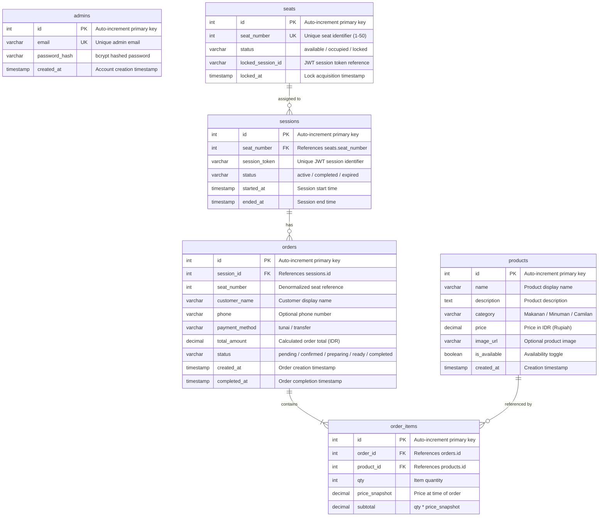
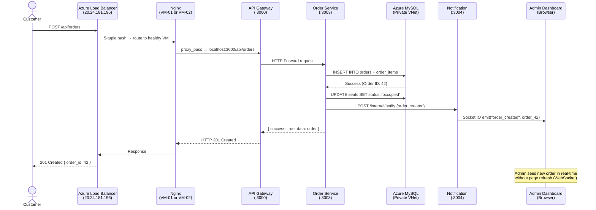
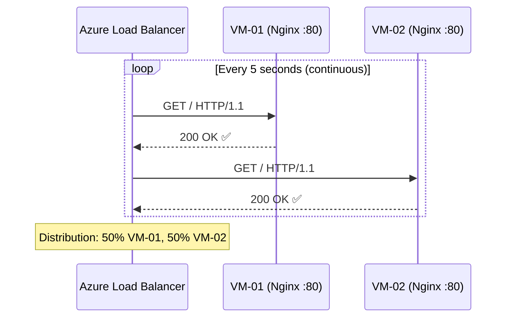
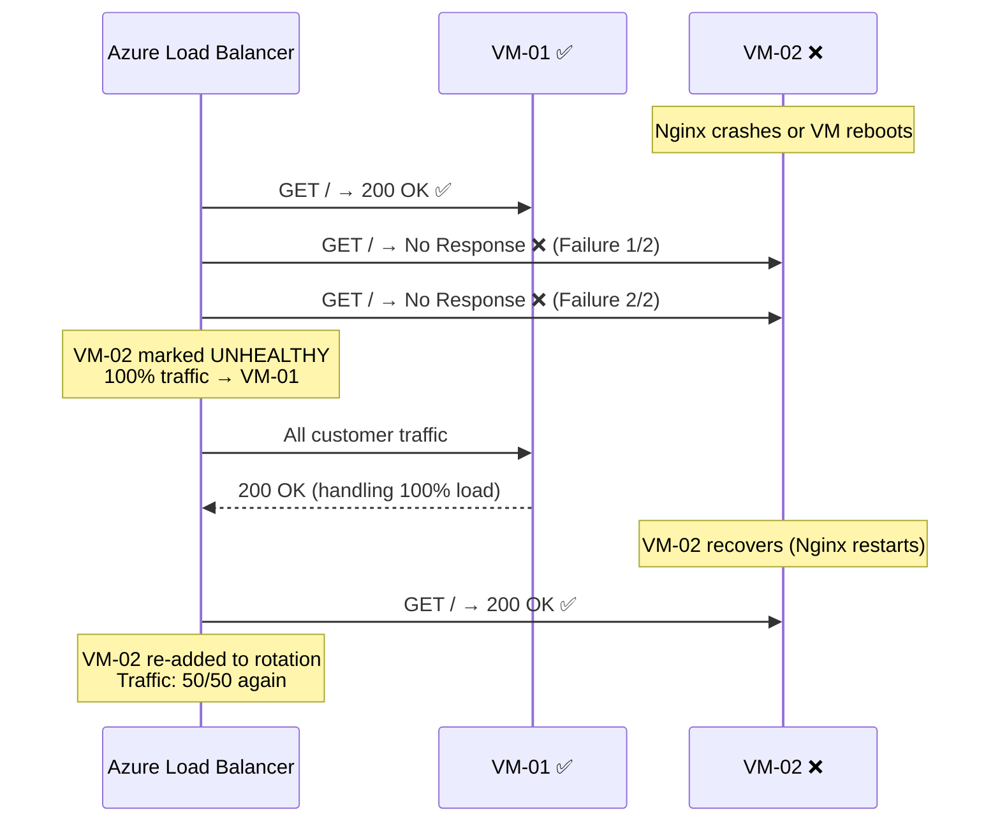
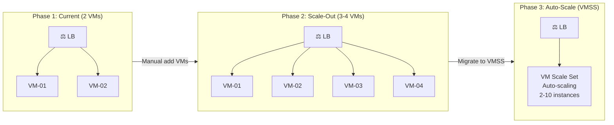

# Infrastructure Reference — SistrackV2 Enterprise Cloud Environment

> **Document Version**: 3.0  
> **Last Updated**: June 2026  
> **Classification**: Confidential — Academic Final Project Deliverable  
> **Author**: Adam Yudhistira Muhtar  
> **Purpose**: Referensi teknis lengkap untuk seluruh infrastruktur cloud SistrackV2.

---

## Table of Contents

- [1. VM Configuration Matrix](#1-vm-configuration-matrix)
- [2. Software Stack per VM](#2-software-stack-per-vm)
- [3. Port Mapping & Network Flow](#3-port-mapping--network-flow)
- [4. Nginx Configuration Reference](#4-nginx-configuration-reference)
- [5. PM2 Process Inventory](#5-pm2-process-inventory)
- [6. Database Schema Reference](#6-database-schema-reference)
- [7. Environment Variables Reference](#7-environment-variables-reference)
- [8. End-to-End Network Flow Diagrams](#8-end-to-end-network-flow-diagrams)
- [9. Azure Monitor Integration](#9-azure-monitor-integration)
- [10. Logging Architecture](#10-logging-architecture)
- [11. Backup & Recovery Strategy](#11-backup--recovery-strategy)
- [12. Scaling Strategy](#12-scaling-strategy)

---

## 1. VM Configuration Matrix

Perbandingan spesifikasi teknis antara kedua Virtual Machine dalam cluster:

| Property | VM-01 (sistrack-web-vm) | VM-02 (sistrack-web-vm2) |
| :--- | :--- | :--- |
| **Hostname** | `sistrack-web-vm` | `sistrack-web-vm2` |
| **Role** | Primary Compute Node | Secondary Compute Node |
| **OS** | Ubuntu 22.04 LTS (Jammy Jellyfish) Gen2 | Ubuntu 22.04 LTS (Jammy Jellyfish) Gen2 |
| **Size** | Standard_B1s (1 vCPU, 1 GiB RAM) | Standard_B1s (1 vCPU, 1 GiB RAM) |
| **Disk** | 30 GB Premium SSD (P4) | 30 GB Premium SSD (P4) |
| **Private IP** | 10.0.1.4 (Static) | 10.0.1.5 (Static) |
| **Public IP** | None (via Load Balancer) | None (completely isolated) |
| **Subnet** | web-subnet (10.0.1.0/24) | web-subnet (10.0.1.0/24) |
| **NSG** | sistrack-web-nsg | sistrack-web-nsg |
| **Availability Set** | sistrack-avset (FD-0) | sistrack-avset (FD-1) |
| **SSH User** | azureuser | azureuser |
| **SSH Key Type** | RSA 4096-bit | RSA 4096-bit |
| **Node.js** | v20.x LTS (via NVM) | v20.x LTS (via NVM) |
| **PM2** | v5.3+ (Latest Stable) | v5.3+ (Latest Stable) |
| **Nginx** | 1.18+ (Ubuntu Package) | 1.18+ (Ubuntu Package) |
| **Server ID Badge** | `VM-01` | `VM-02` |

> **Prinsip Konfigurasi**: Kedua VM **HARUS identik** dalam hal software stack, konfigurasi Nginx, file `.env`, dan versi kode aplikasi. Perbedaan hanya pada Private IP dan Server ID Badge (untuk demo Load Balancer).

---

## 2. Software Stack per VM

Setiap VM menjalankan stack identik berikut. Diagram ini menunjukkan seluruh layer software dari OS hingga database:

```
┌─────────────────────────────────────────────┐
│           Ubuntu 22.04 LTS (Gen2)            │
│           Kernel: 5.15.x                     │
├─────────────────────────────────────────────┤
│  🔀 Nginx Web Server (Port 80/443)           │
│  ├── Static Files: /var/www/sistrack/         │
│  │   └── frontend/dist/ (Vue.js SPA Build)   │
│  ├── Reverse Proxy: / → localhost:3000       │
│  └── WebSocket Upgrade Headers: Configured   │
├─────────────────────────────────────────────┤
│  🔄 PM2 Process Manager (Daemon Mode)         │
│  ├── gateway              (HTTP  Port 3000)  │
│  ├── auth-service         (HTTP  Port 3001)  │
│  ├── product-service      (HTTP  Port 3002)  │
│  ├── order-service        (HTTP  Port 3003)  │
│  ├── notification-service (WS    Port 3004)  │
│  └── analytics-service    (gRPC  Port 50051) │
├─────────────────────────────────────────────┤
│  🟢 Node.js v20.x LTS (via NVM)              │
│  📦 NPM Package Manager                      │
│  🗃️ MySQL Client (mysql2/promise connector)   │
└──────────────────┬──────────────────────────┘
                   │ TCP 3306 (Private VNet)
                   ▼
┌─────────────────────────────────────────────┐
│  🗄️ Azure MySQL Flexible Server              │
│  ├── Engine: MySQL 8.0                       │
│  ├── Database: sistrackv2                    │
│  ├── Compute: Burstable B1ms                 │
│  └── Access: VNet Integration Only           │
└─────────────────────────────────────────────┘
```

---

## 3. Port Mapping & Network Flow

### External Ports (Internet → Load Balancer → VM)

| Port | Protocol | Service | Direction | NSG Rule | Notes |
| :---: | :--- | :--- | :--- | :--- | :--- |
| 80 | HTTP | Nginx (Frontend + API Proxy) | Inbound | Allow-HTTP | Primary web traffic |
| 443 | HTTPS | Nginx (SSL Termination) | Inbound | Allow-HTTPS | Future TLS implementation |
| 22 | SSH | Remote Management | Inbound | Allow-SSH | Restricted to trusted IPs |

### Internal Ports (VM Localhost — Never Exposed to Internet)

| Port | Service | Protocol | Description | Communication Pattern |
| :---: | :--- | :--- | :--- | :--- |
| 3000 | API Gateway | HTTP/REST | Central ingress controller | Client → Gateway |
| 3001 | Auth Service | HTTP/REST | JWT authentication & authorization | Gateway → Auth |
| 3002 | Product Service | HTTP/REST | Menu catalog management | Gateway → Product |
| 3003 | Order Service | HTTP/REST | Order lifecycle & seat management | Gateway → Order |
| 3004 | Notification Service | HTTP/WebSocket | Socket.IO real-time events | Client ↔ Notification |
| 50051 | Analytics Service | gRPC (Protobuf) | Binary analytics protocol | Gateway → Analytics |
| 3306 | Azure MySQL | TCP | Database connection (via VNet) | Services → Database |

> **Keamanan**: Port 3000–50051 **tidak pernah diekspos ke internet**. Hanya Nginx (Port 80) yang menerima trafik dari Load Balancer, kemudian mem-proxy secara internal ke `localhost:3000`. Arsitektur ini memberikan **double firewall** — NSG di level jaringan dan Nginx di level aplikasi.

---

## 4. Nginx Configuration Reference

### Configuration File
File lokasi: `/etc/nginx/sites-available/sistrack`

```nginx
server {
    listen 80;
    server_name _;

    # ─── Frontend (Vue.js Static Build) ───
    location / {
        root /var/www/sistrack/frontend/dist;
        index index.html;
        try_files $uri $uri/ /index.html;
        
        # Cache static assets for performance
        location ~* \.(js|css|png|jpg|jpeg|gif|ico|svg|woff2?)$ {
            expires 7d;
            add_header Cache-Control "public, immutable";
        }
    }

    # ─── Backend API Gateway (Reverse Proxy) ───
    location /api/ {
        proxy_pass http://localhost:3000/api/;
        proxy_http_version 1.1;
        
        # WebSocket upgrade support (required for Socket.IO)
        proxy_set_header Upgrade $http_upgrade;
        proxy_set_header Connection 'upgrade';
        proxy_set_header Host $host;
        proxy_cache_bypass $http_upgrade;

        # Forward real client IP (important for rate limiting & logging)
        proxy_set_header X-Real-IP $remote_addr;
        proxy_set_header X-Forwarded-For $proxy_add_x_forwarded_for;
        proxy_set_header X-Forwarded-Proto $scheme;
        
        # Timeout configuration
        proxy_connect_timeout 60s;
        proxy_send_timeout 60s;
        proxy_read_timeout 60s;
    }
}
```

### Key Configuration Decisions

| Directive | Purpose |
| :--- | :--- |
| `try_files $uri $uri/ /index.html` | SPA fallback — semua route Vue.js diarahkan ke `index.html` |
| `proxy_set_header Upgrade` | Mengizinkan WebSocket upgrade untuk Socket.IO |
| `proxy_set_header X-Real-IP` | Meneruskan IP asli klien (bukan IP Load Balancer) untuk rate limiting |
| `expires 7d` | Cache static assets di browser selama 7 hari untuk performa |

### Nginx Synchronization Strategy

Kedua VM **HARUS** memiliki konfigurasi Nginx yang identik. Jika ada perubahan:

```bash
# Dari VM-01, sync config ke VM-02 via internal network
scp /etc/nginx/sites-available/sistrack azureuser@10.0.1.5:/tmp/sistrack-nginx

# Di VM-02, apply config
ssh azureuser@10.0.1.5 "sudo mv /tmp/sistrack-nginx /etc/nginx/sites-available/sistrack && sudo nginx -t && sudo systemctl restart nginx"
```

---

## 5. PM2 Process Inventory

### Expected `pm2 status` Output (Identical pada Kedua VM)

```
┌────┬──────────────────────┬──────────┬──────┬───────────┬──────────┬──────────┐
│ id │ name                 │ mode     │ ↺    │ status    │ cpu      │ memory   │
├────┼──────────────────────┼──────────┼──────┼───────────┼──────────┼──────────┤
│ 0  │ gateway              │ fork     │ 0    │ online    │ 0%       │ ~45MB    │
│ 1  │ auth-service         │ fork     │ 0    │ online    │ 0%       │ ~35MB    │
│ 2  │ product-service      │ fork     │ 0    │ online    │ 0%       │ ~35MB    │
│ 3  │ order-service        │ fork     │ 0    │ online    │ 0%       │ ~40MB    │
│ 4  │ notification-service │ fork     │ 0    │ online    │ 0%       │ ~30MB    │
│ 5  │ analytics-service    │ fork     │ 0    │ online    │ 0%       │ ~35MB    │
└────┴──────────────────────┴──────────┴──────┴───────────┴──────────┴──────────┘
```

### PM2 Ecosystem Configuration

File: `/var/www/sistrack/ecosystem.config.js`

| Service | Entry Point | Working Directory | Auto-Restart | Watch |
| :--- | :--- | :--- | :--- | :--- |
| gateway | `src/index.js` | `backend/gateway/` | Yes | No |
| auth-service | `src/index.js` | `backend/auth-service/` | Yes | No |
| product-service | `src/index.js` | `backend/product-service/` | Yes | No |
| order-service | `src/index.js` | `backend/order-service/` | Yes | No |
| notification-service | `src/index.js` | `backend/notification-service/` | Yes | No |
| analytics-service | `src/index.js` | `backend/analytics-service/` | Yes | No |

### PM2 Management Commands
```bash
pm2 status              # Lihat status semua proses
pm2 logs                # Lihat log real-time (semua service)
pm2 logs gateway        # Lihat log spesifik gateway
pm2 restart all         # Restart semua proses
pm2 restart gateway     # Restart hanya gateway
pm2 monit               # Monitor CPU/RAM real-time (TUI)
pm2 save                # Simpan daftar proses untuk auto-start
pm2 startup             # Generate systemd script untuk boot persistence
pm2 flush               # Bersihkan semua log files
```

---

## 6. Database Schema Reference

Azure MySQL Flexible Server (`sistrack-mysql-prod`) berisi database `sistrackv2` dengan skema berikut:



### Table Statistics (After Seeding)

| Table | Row Count | Purpose |
| :--- | :---: | :--- |
| `admins` | 1 | Default admin account |
| `products` | 35 | Restaurant menu items (Makanan, Minuman, Camilan) |
| `seats` | 50 | Available restaurant seats (1-50) |
| `sessions` | Dynamic | Customer ordering sessions |
| `orders` | Dynamic | Completed and in-progress orders |
| `order_items` | Dynamic | Individual items within each order |

---

## 7. Environment Variables Reference

File: `/var/www/sistrack/backend/gateway/.env` (Identical pada kedua VM)

| Variable | Example Value | Description | Sensitive? |
| :--- | :--- | :--- | :--- |
| `PORT` | `3000` | Gateway listen port | No |
| `DB_HOST` | `sistrack-mysql-prod.mysql.database.azure.com` | Azure MySQL FQDN hostname | No |
| `DB_USER` | `sistrack_admin` | Database username | Yes |
| `DB_PASSWORD` | `P@ssw0rdSuperKuat123!` | Database password | **Yes** |
| `DB_NAME` | `sistrackv2` | Database schema name | No |
| `JWT_SECRET` | `SangatRahasiaSekali123!...` | JWT HMAC signing key | **Yes** |
| `AUTH_SERVICE_URL` | `http://localhost:3001` | Auth service endpoint | No |
| `PRODUCT_SERVICE_URL` | `http://localhost:3002` | Product service endpoint | No |
| `ORDER_SERVICE_URL` | `http://localhost:3003` | Order service endpoint | No |
| `NOTIFICATION_SERVICE_URL` | `http://localhost:3004` | Notification service endpoint | No |
| `ANALYTICS_GRPC_URL` | `localhost:50051` | Analytics gRPC endpoint | No |
| `ALLOWED_ORIGINS` | `http://20.24.181.196` | CORS whitelist (LB Public IP) | No |

> **IMPORTANT**: 
> 1. File `.env` harus **identik** di VM-01 dan VM-02. 
> 2. Semua service URL menggunakan `localhost` karena setiap VM menjalankan stack lengkapnya sendiri.
> 3. `ALLOWED_ORIGINS` **harus** berisi IP Load Balancer, bukan IP individual VM.

---

## 8. End-to-End Network Flow Diagrams

### Customer Order Flow (Complete Journey)



### Health Probe Flow (Background — Every 5 Seconds)



### Failover Scenario Flow



---

## 9. Azure Monitor Integration

### Metrics to Monitor

| Metric | Source | Alert Threshold | Severity | Alert Name |
| :--- | :--- | :--- | :--- | :--- |
| **Health Probe Status** | Load Balancer | < 100% for > 2 min | Critical (Sev 0) | `LB-Unhealthy-VM` |
| **CPU Percentage** | VM-01 / VM-02 | > 80% for > 5 min | Warning (Sev 2) | `VM-High-CPU` |
| **Available Memory** | VM-01 / VM-02 | < 200 MB | Critical (Sev 1) | `VM-Low-Memory` |
| **Data Path Availability** | Load Balancer | < 99% | Critical (Sev 0) | `LB-Data-Path-Down` |
| **SYN Count** | Load Balancer | > 1000/min | Warning (Sev 2) | `Possible-DDoS` |
| **SNAT Connection Count** | Load Balancer | > 80% of limit | Warning (Sev 2) | `SNAT-Exhaustion` |
| **DB Storage Percent** | MySQL Server | > 85% | Warning (Sev 2) | `DB-Storage-Full` |

### Setup Azure Monitor Alert (Step-by-Step)
1. **Azure Portal** → `sistrack-lb` → **Metrics**
2. Select Metric: `Health Probe Status` → Aggregation: `Average`
3. Click **New alert rule** → Condition: `Average < 100` → Period: `5 minutes`
4. Action Group: Email notification to project maintainer
5. Alert rule name: `LB-Unhealthy-VM`

---

## 10. Logging Architecture

```
┌──────────────────────────────────────────────────┐
│                  Each VM (VM-01 / VM-02)          │
├──────────────────────────────────────────────────┤
│  📋 Nginx Access Log                              │
│  → /var/log/nginx/access.log                      │
│  Format: $remote_addr - $time - $request - $status│
│                                                    │
│  ❌ Nginx Error Log                                │
│  → /var/log/nginx/error.log                        │
│  Contains: 502, 504, config errors                 │
│                                                    │
│  📊 PM2 Application Logs (per service)             │
│  → ~/.pm2/logs/gateway-out.log                     │
│  → ~/.pm2/logs/gateway-error.log                   │
│  → ~/.pm2/logs/auth-service-out.log                │
│  → ~/.pm2/logs/auth-service-error.log              │
│  → ~/.pm2/logs/product-service-out.log             │
│  → ~/.pm2/logs/order-service-out.log               │
│  → ~/.pm2/logs/order-service-error.log             │
│  → ~/.pm2/logs/notification-service-out.log        │
│  → ~/.pm2/logs/analytics-service-out.log           │
│                                                    │
│  🖥️ System Logs                                    │
│  → /var/log/syslog (general system events)         │
│  → journalctl -u nginx (Nginx systemd journal)     │
└──────────────────────────────────────────────────┘
```

### Useful Log Commands
```bash
# ─── Nginx Logs ───
sudo tail -f /var/log/nginx/access.log     # Real-time access log
sudo tail -f /var/log/nginx/error.log      # Real-time error log
sudo tail -100 /var/log/nginx/error.log    # Last 100 error lines

# ─── PM2 Logs ───
pm2 logs                                   # All services combined
pm2 logs gateway --lines 100               # Gateway last 100 lines
pm2 logs order-service --lines 50          # Order service last 50

# ─── System Logs ───
sudo journalctl -u nginx -f               # Nginx systemd journal
sudo dmesg | tail -20                      # Kernel messages
```

---

## 11. Backup & Recovery Strategy

| Component | Method | Frequency | Retention | RTO |
| :--- | :--- | :--- | :--- | :--- |
| **Azure MySQL** | Azure Built-in Automatic Backup | Daily + Continuous WAL | 7 days (Point-in-Time) | 30-60 min |
| **Application Code** | GitHub Repository | Every `git push` | Permanent (Git history) | 5 min |
| **Nginx Config** | Git-managed + manual SCP | On change | In repository | 5 min |
| **.env Files** | Manual backup (recommended: Azure Key Vault) | On change | Encrypted copy | 5 min |
| **PM2 Process List** | `pm2 save` + `pm2 startup` | After config change | Persisted in systemd | 2 min |

### Database Point-in-Time Restore
Azure MySQL Flexible Server mendukung **Point-in-Time Restore** — kemampuan untuk mengembalikan database ke kondisi tepat di detik tertentu dalam 7 hari terakhir.

```bash
# Restore via Azure CLI
az mysql flexible-server restore \
  --resource-group Sistrack-RG \
  --name sistrack-mysql-prod-restored \
  --source-server sistrack-mysql-prod \
  --restore-time "2026-06-10T12:00:00Z"
```

---

## 12. Scaling Strategy

### Horizontal Scaling (Menambah VM Baru)

Untuk menambahkan VM-03 ke cluster (jika diperlukan):

```bash
# 1. Create new VM in Availability Set
az vm create \
  --resource-group Sistrack-RG \
  --name sistrack-web-vm3 \
  --image Canonical:0001-com-ubuntu-server-jammy:22_04-lts-gen2:latest \
  --size Standard_B1s \
  --availability-set sistrack-avset \
  --vnet-name sistrack-vnet \
  --subnet web-subnet \
  --public-ip-address "" \
  --admin-username azureuser \
  --ssh-key-values ~/.ssh/sistrack-ssh-key.pub

# 2. Deploy application (clone, install, build, start PM2)
# 3. Add NIC to backend pool
az network nic ip-config address-pool add \
  --resource-group Sistrack-RG \
  --nic-name sistrack-web-vm3VMNic \
  --ip-config-name ipconfig1 \
  --lb-name sistrack-lb \
  --address-pool sistrack-backend-pool
```

**Tidak perlu mengubah Load Balancer rules.** VM baru langsung masuk rotasi setelah Health Probe mendeteksinya healthy.

### Vertical Scaling (Upgrade VM Size)
```bash
az vm deallocate --resource-group Sistrack-RG --name sistrack-web-vm
az vm resize --resource-group Sistrack-RG --name sistrack-web-vm --size Standard_B2s
az vm start --resource-group Sistrack-RG --name sistrack-web-vm
```

### Architecture Growth Path



---

<div align="center">
  <b>SisTrackV2 Enterprise</b> &copy; 2026 Adam Yudhistira Muhtar. All Rights Reserved.<br>
  <i>Confidential & Proprietary Infrastructure Reference.</i>
</div>
