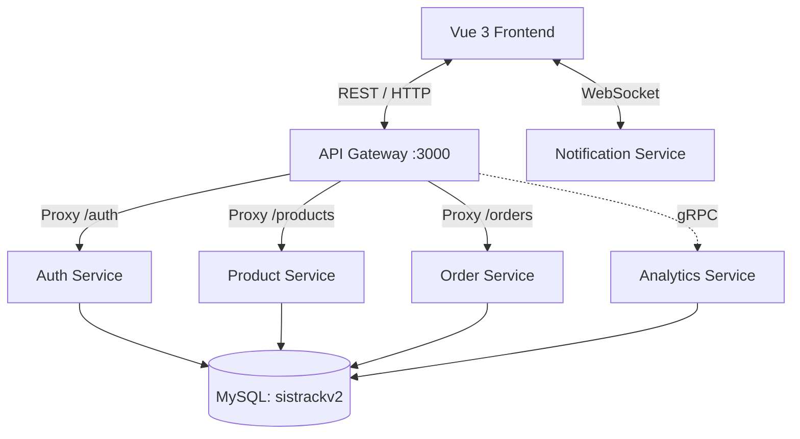

# [LAYER 1] Dokumentasi Project yang Ada (Existing Project)

## 1. Introduction

### 1.1 Purpose
Dokumen ini menguraikan Software Requirements Specification (SRS) dan Arsitektur Sistem dari **SistrackV2** secara *as-is*. Tujuannya adalah memberikan pemahaman mendalam tentang struktur kode, arsitektur *microservices*, dan alur data yang saat ini berjalan, baik untuk *onboarding* *developer* baru maupun sebagai dasar analisis pengembangan.

### 1.2 Scope
SistrackV2 adalah sebuah aplikasi reservasi/pemesanan *(Ordering and Seating System)* yang memungkinkan pelanggan (Customer) untuk memilih meja (SeatSelect), melihat menu, dan melakukan pembayaran/checkout. Sistem ini juga memiliki antarmuka Dasbor Admin untuk mengelola data dan memantau status pesanan dan analitik.

### 1.3 Technologies Used
Sistem dibangun menggunakan tumpukan teknologi modern yang berfokus pada JavaScript/TypeScript *ecosystem*:
- **Frontend**: Vue 3, Vue Router, Vite, TailwindCSS, Chart.js, Socket.IO Client.
- **Backend (Microservices)**: Node.js, Express.js, gRPC, Socket.IO, JWT untuk autentikasi, `http-proxy-middleware` untuk API Gateway.
- **Database**: MySQL (diakses menggunakan konektor `mysql2/promise`).

---

## 2. Overall Description

### 2.1 Product Perspective
Sistem beroperasi sebagai aplikasi berbasis web yang memiliki dua jenis klien utama:
1. **Public/Customer View**: Diakses tanpa autentikasi ketat di awal. Pelanggan memilih nomor kursi (`SeatSelect`), mengakses menu (`Menu`), dan menyelesaikan pesanan (`Checkout`).
2. **Admin View**: Terlindungi oleh JWT Token (`AdminLogin`). Memungkinkan staf atau pengelola restoran mengakses `AdminDashboard`.

### 2.2 Operating Environment
- **Server**: Berjalan di atas environment Node.js minimal versi 18.x.
- **Database**: Membutuhkan server MySQL (biasanya port 3306).
- **Client**: Berjalan pada *browser* web modern (Chrome, Safari, Firefox, Edge).

---

## 3. System Architecture

Aplikasi *backend* saat ini mengadopsi arsitektur **Microservices** yang dikoordinasikan oleh sebuah **API Gateway**.

### 3.1 Komponen Microservices
1. **API Gateway (`gateway`)**: Bertindak sebagai *reverse proxy*. Merutekan *request* masuk dari *client* ke *service* yang tepat. Memiliki *middleware* pengecekan JWT Token untuk proteksi *route* Admin.
2. **Auth Service (`auth-service`)**: Menangani proses *login*, verifikasi *password* menggunakan *bcrypt*, dan penerbitan *JSON Web Token* (JWT).
3. **Product Service (`product-service`)**: Mengelola katalog menu dan produk. Membedakan rute publik (`/api/products/available`) dan rute admin (`/api/products`).
4. **Order Service (`order-service`)**: Mengelola transaksi, pembuatan pesanan dari pelanggan, dan status pesanan.
5. **Analytics Service (`analytics-service`)**: Berkomunikasi menggunakan **gRPC**. Mengambil data ringkasan analitik (penjualan, tren) yang selanjutnya dipanggil oleh API Gateway.
6. **Notification Service (`notification-service`)**: Service mandiri berbasis *Socket.IO* untuk memberikan pembaruan (*real-time update*) ke klien.
7. **Shared (`shared`)**: Kumpulan modul dan *library* yang digunakan ulang oleh *service-service* lain (misalnya konfigurasi logger).

---

## 4. Data Model

Sistem saat ini menggunakan **Shared Database Pattern**. Meskipun *source code* dipisah menjadi beberapa *microservice*, semua *service* tersebut melakukan *query* ke satu database fisik yang sama yaitu `sistrackv2`.

Skema konseptual entitas yang ada dalam basis data MySQL:
- **`users` / `admins`**: Tabel untuk menyimpan data autentikasi (username, *hashed password*).
- **`products`**: Menyimpan ID produk, nama, harga, status ketersediaan (available/sold out).
- **`orders`**: Menyimpan data transaksi, referensi kursi/meja (seat), total harga, dan status pesanan.
- **`order_items`**: Tabel relasi *many-to-many* antara *orders* dan *products* (menyimpan *quantity* dan *subtotal*).

*(Catatan: Saat ini setiap service seperti Auth, Product, dan Order melakukan inisialisasi koneksi pool masing-masing ke database MySQL ini via file `db.js`).*

---

## 5. API & Integrasi

### 5.1 RESTful APIs (via Gateway)
Sebagian besar komunikasi HTTP direlai melalui API Gateway di port `3000`.
- **`POST /api/auth/login`** $\rightarrow$ Diteruskan (*forwarded*) secara langsung menggunakan *Axios* ke Auth Service.
- **`GET /api/products/available`** $\rightarrow$ Proxy ke Product Service (Tanpa Autentikasi).
- **`GET/POST /api/products/*`** $\rightarrow$ Proxy ke Product Service (Membutuhkan JWT Token).
- **`POST /api/orders`** $\rightarrow$ Diteruskan menggunakan *Axios* ke Order Service.
- **`GET /api/analytics/dashboard`** $\rightarrow$ Gateway mengeksekusi koneksi **gRPC** ke Analytics Service dan mengembalikan response JSON ke *client*.

### 5.2 Real-time Communication
- Frontend menginisiasi koneksi WebSockets ke `Notification Service` melalui *library* `socket.io-client`.

---

## 6. Cara Menjalankan Lokal

Pendekatan *development* lokal saat ini membutuhkan beberapa proses yang berjalan paralel.

1. **Persiapan Database**:
   - Pastikan MySQL server menyala.
   - Buat database dengan nama `sistrackv2`.
   - Konfigurasikan variabel *environment* `.env` pada tiap folder *service* (*backend*) untuk kredensial database (Host, User, Password).
2. **Menjalankan Backend**:
   - Terdapat sebuah skrip PowerShell `run.all.ps1` di *root directory* untuk memutar semua *microservices* sekaligus.
   - Atau masuk ke setiap sub-folder (`gateway`, `auth-service`, dll.), jalankan `npm install`, lalu `npm run dev` (memakai `nodemon`).
3. **Menjalankan Frontend**:
   - Pindah ke folder `frontend`.
   - Eksekusi `npm install`.
   - Jalankan `npm run dev` (Vite akan membuka server lokal, misalnya di `http://localhost:5173`).
