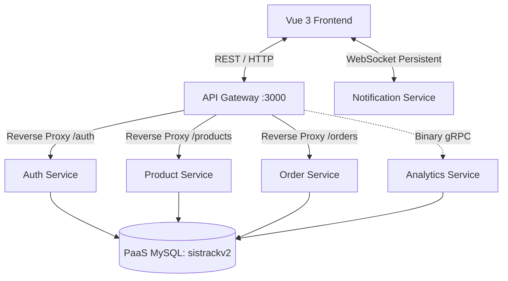

# [LAYER 1] SistrackV2 Enterprise: Existing Project Architecture Analysis

> **Document Version**: 3.0  
> **Last Updated**: June 2026  
> **Classification**: Confidential — Academic Final Project Deliverable  
> **Author**: Adam Yudhistira Muhtar  

## 1. Introduction

### 1.1 Purpose
Dokumen ini menguraikan Software Requirements Specification (SRS) dan Arsitektur Sistem dari **SistrackV2** secara *as-is*. Tujuannya adalah memberikan pemahaman mendalam tentang struktur kode, arsitektur *microservices*, dan alur data yang beroperasi di dalam kluster peladen, baik untuk *onboarding developer* maupun audit infrastruktur.

### 1.2 Scope
SistrackV2 merupakan *Enterprise Ordering and Seating System* otonom yang memungkinkan pelanggan (Customer) untuk mereservasi meja, mengakses menu, dan mengeksekusi pembayaran secara mulus. Platform ini dilengkapi Dasbor Administratif *Real-Time* guna memonitor siklus pesanan dan menghitung analitik intelijen bisnis.

### 1.3 Technologies Used
Sistem dibangun secara tangguh menggunakan *JavaScript/TypeScript ecosystem*:
- **Frontend**: Vue 3, Vue Router, Vite, TailwindCSS, Chart.js, Socket.IO Client.
- **Backend (Microservices Cluster)**: Node.js, Express.js, gRPC, Socket.IO, JWT Cryptography, `http-proxy-middleware`.
- **Database Layer**: Relational MySQL.

---

## 2. Overall Description

### 2.1 Product Perspective
Platform ini melayani dua antarmuka (Client-Facing & Internal):
1. **Public/Customer View**: *Self-Service Kiosk* publik yang melayani pemilihan nomor kursi, visualisasi katalog menu, dan *checkout* transaksional secara anonim (tanpa otentikasi login).
2. **Admin View**: Area terklasifikasi yang dilindungi oleh Enkripsi Token JWT. Diotorisasi secara ketat untuk staf yang memantau dasbor *real-time* dapur.

### 2.2 Operating Environment
- **Compute Runtime**: Node.js minimal versi 18.x LTS pada Ubuntu Linux.
- **Database Engine**: Azure MySQL Flexible Server / Local MySQL (Port 3306).
- **Client**: Berjalan pada *browser* standar berbasis Chromium atau WebKit.

---

## 3. System Architecture

Alih-alih mengandalkan arsitektur *Monolith*, SistrackV2 menggunakan arsitektur **Distributed Microservices** dengan manajemen titik masuk terpusat menggunakan **API Gateway**.

### 3.1 Komponen Microservices
1. **API Gateway (`gateway`)**: Bertindak sebagai *Reverse Proxy Controller*. Mendistribusikan *request* masuk ke layanan yang tepat dan menerapkan *Rate Limiting* serta validasi JWT Token.
2. **Auth Service (`auth-service`)**: Menangani proses otentikasi, enkripsi *password* satu arah (Bcrypt), dan penerbitan *JSON Web Token* (JWT).
3. **Product Service (`product-service`)**: Engine manajerial *Inventory* katalog produk makanan dan minuman.
4. **Order Service (`order-service`)**: Mesin pemrosesan transaksi utama (*Core Transaction Engine*).
5. **Analytics Service (`analytics-service`)**: Modul agregat data bervolume tinggi yang berkomunikasi via **gRPC** untuk mencegah kemacetan HTTP pada peladen.
6. **Notification Service (`notification-service`)**: Saluran *push-notification* *real-time* berbasis *Socket.IO*.
7. **Shared Library (`shared`)**: Kumpulan modul fungsional (*Logger*, *Config*) yang didistribusikan silang antar-mikrolayanan.

---

## 4. Data Model

Sistem menerapkan **Shared Database Pattern** dalam level microservices. Semua *service* secara terpusat melakukan kueri ke satu instansi basis data `sistrackv2` untuk mencapai determinisme data.

*Key Entities:*
- **`users` / `admins`**: Entitas otorisasi kriptografi.
- **`products`**: Master data persediaan.
- **`orders`**: Data rekaman siklus pesanan dan referensi kursi.
- **`order_items`**: Rekaman detil transaksi (Relasi *many-to-many*).

---

## 5. API & Integrasi

### 5.1 RESTful APIs (via Gateway)
Mayoritas komunikasi ditangani lewat API Gateway di port TCP `3000`.
- **`POST /api/auth/login`** $\rightarrow$ Rute Otentikasi.
- **`GET /api/products/available`** $\rightarrow$ Pengambilan Katalog Publik.
- **`POST /api/orders`** $\rightarrow$ Pencatatan Injeksi Transaksi.
- **`GET /api/analytics/dashboard`** $\rightarrow$ Gateway mengeksekusi koneksi **gRPC** secara asinkron ke layanan Analitik dan merender respon JSON ke layar eksekutif.

### 5.2 Real-time Communication
Koneksi konstan dua-arah dipertahankan antara Klien dan *Notification Service* melalui perpustakaan `socket.io-client`.

---

  <b>SisTrackV2 Enterprise</b> &copy; 2026 Adam Yudhistira Muhtar. All Rights Reserved. 
  <i>Confidential & Proprietary Infrastructure Reference.</i>

